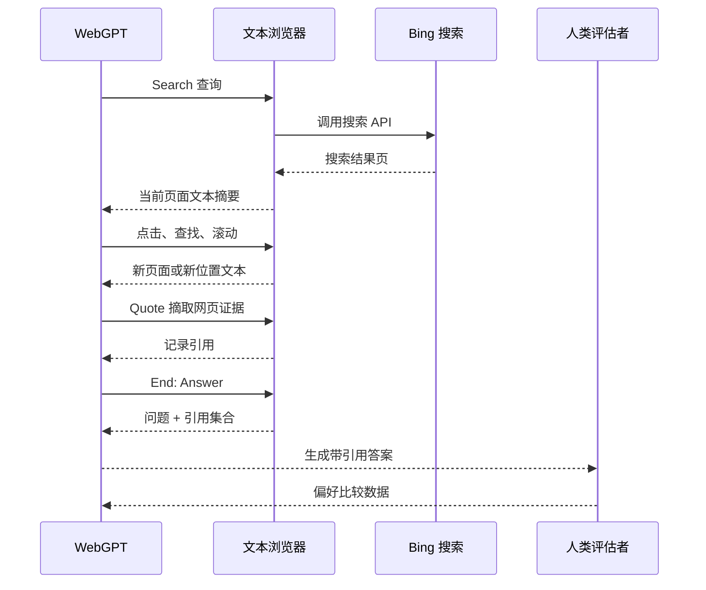
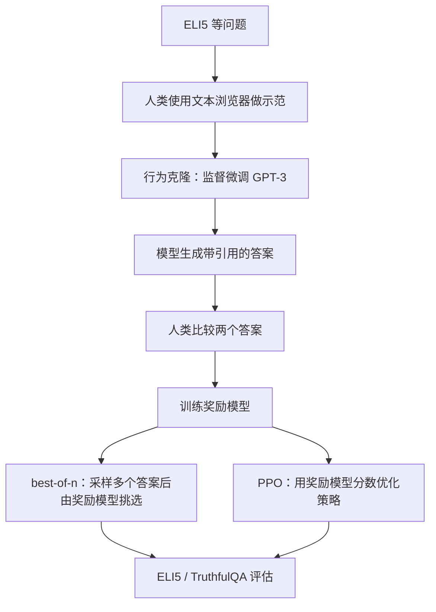

论文：[WebGPT: Browser-assisted question-answering with human feedback](https://arxiv.org/abs/2112.09332)，OpenAI，arXiv v1 提交于 2021-12-17，v3 修订于 2022-06-01。OpenAI 在 2021-12-16 发布了对应介绍：[WebGPT: Improving the factual accuracy of language models through web browsing](https://openai.com/index/webgpt/)。

这篇没有看到正式发表于会议或期刊的信息。更准确的引用方式是 arXiv / OpenAI research publication。

WebGPT 在 Agent 时间线里的位置很靠前。它不是 ReAct 那种通用行动闭环，也不是后来的完整浏览器 GUI Agent；它更像一个前史节点：把 GPT-3 放进一个受限的文本浏览器，让模型通过搜索、点击、滚动、引用网页证据，再写出长问答答案。

它真正重要的地方不是“接了搜索引擎”这么简单，而是把 **文本浏览器环境、带引用的答案、人类偏好训练** 绑在一起。这三者一起回答了一个早期问题：如果模型要回答开放世界里的长问题，能不能让它像人一样先查资料，再根据资料组织答案，并且让人类更容易检查答案里的事实声明？

如果放在后来的 Agent 语境里看，WebGPT 的结构已经有了一个很小的闭环：

```text
观察当前网页状态 -> 选择浏览器动作 -> 环境返回新网页文本 -> 收集引用 -> 结束浏览 -> 基于引用写答案
```

但这个闭环很窄。它不做长期任务规划，不维护长期记忆，也不能真实操作网页。它的目标就是长问答：把“模型凭训练语料回答”改造成“模型在受限网页环境里查证后回答”。

## 先看它解决什么问题

论文面对的是长问答（long-form question answering）。这类问题不是一句事实就能回答完，而是需要检索资料、筛选证据、综合成段落答案。例如 ELI5 上的开放式问题，经常需要解释背景、给出原因、处理细节。

传统检索增强生成（RAG）更常见的做法是：

```text
query -> 检索相关文档 -> 把文档塞给生成模型 -> 生成答案
```

WebGPT 的做法更接近人类上网查资料。这里的“浏览器”不是完整 GUI 浏览器，而是一个文本界面：

```text
问题 -> 搜索网页 -> 点开结果 -> 页面内查找 -> 摘取引用 -> 继续搜索 -> 写答案
```

它没有训练一个端到端可微分 retriever，而是直接借用 Bing Web Search API，把重点放在“模型如何使用搜索引擎和网页证据回答问题”。这也是它和许多 RAG 系统的关键差别：检索不是一次性前处理，而是模型动作序列的一部分。

可以把它理解成一个很早的“浏览器辅助问答环境”。论文明确说，它利用现成搜索引擎解决文档检索，利用 GPT-3 的预训练能力解决答案综合，真正要研究的是如何把这两个能力组合成一个可以由人示范、可以由人比较、可以用奖励模型优化的任务。

## 第 2 节：浏览器环境是什么

WebGPT 的环境是一个文本化浏览器，不是我们日常看到的完整图形浏览器。模型每一步看到的是当前状态的文字摘要，包括问题、当前页面片段、已收集引用、过去动作、剩余动作数等。论文 Figure 1 的例子里，问题是“如何训练附近的乌鸦给我带礼物”，当前页面显示搜索结果、页面标题、若干链接摘要、已经引用的片段、过去动作，以及还剩多少步动作。

模型必须输出固定命令。论文给出的动作空间包括：

```text
Search <query>
Clicked on link <link ID>
Find in page: <text>
Quote: <text>
Scrolled down <1, 2, 3>
Scrolled up <1, 2, 3>
Top
Back
End: Answer
End: <Nonsense, Controversial>
```

这点很关键：WebGPT 的 action space 不是自由自然语言，而是一个受限命令集合。模型如果输出其他文本，就算 invalid action，仍然消耗动作预算。

其中几个动作需要拆开看：

- `Search <query>`：把查询交给 Bing API，返回一个搜索结果页。
- `Clicked on link <link ID>`：只能点击当前页面里已经出现的链接编号，不能随便生成 URL。
- `Find in page: <text>`：在当前网页文本里查找字符串，相当于浏览器里的页内搜索。
- `Quote: <text>`：只有当这段文字真的出现在当前页面里，才会被记录为引用。引用会保存网页标题、域名和摘录内容。
- `End: Answer`：结束浏览，进入最终回答阶段。只要至少收集到一条引用，模型就会看到“问题 + 引用集合”，然后生成答案。
- `End: <Nonsense, Controversial>`：如果问题本身无意义或争议性太强，可以结束并跳过回答阶段。

一次浏览过程大致是：



这里的“记忆”也很受限。每一步重新给模型当前状态摘要，之前发生了什么主要靠 past actions 和已收集 references 进入上下文。它不是一个长期记忆 Agent，也没有 Voyager 那种技能库。论文还专门说，每一步是 fresh context，也就是说浏览历史不是模型内部状态自动保留下来的，而是环境把过去动作和引用重新写进当前观察。

一个简化例子可以这样理解：

```text
问题：为什么某些词会被认为是不适合在社交场合使用的“坏词”？

第 1 步：Search why are some words considered bad words
第 2 步：Clicked on link 0
第 3 步：Find in page: taboo
第 4 步：Quote: 某段解释 taboo / swearing / social norm 的网页文字
第 5 步：Back
第 6 步：Search origin of swear words social norms
第 7 步：Quote: 另一段解释情绪、宗教、身体、身份攻击相关的文字
第 8 步：End: Answer
最终回答：把第 4 步和第 7 步收集到的引用组织成一段长答案。
```

这里模型不是“先一次性检索 5 篇文档再回答”，而是在浏览过程中不断决定下一步查什么、看哪个结果、引用哪段文字。

所以 WebGPT 更准确的定位是：

```text
受限网页浏览环境里的问答 Agent 原型
```

它已经有 action、observation、tool use、引用和人类反馈，但还不是通用规划 Agent。

## 第 3 节：数据和训练方法

论文收集了两类人工数据：

```text
demonstrations：人类示范如何用浏览器回答问题
comparisons：人类比较两个模型答案哪个更好
```

问题主要来自 ELI5。论文说共收集约 6,000 条示范和约 21,500 条比较，其中绝大多数来自 ELI5。附录表格给出的总数是 6,209 demonstrations 和 21,548 comparisons。

训练方法有四种：

```text
1. Behavior Cloning
   用人类浏览示范做监督微调，让模型学会浏览器命令格式和基本搜索策略。

2. Reward Modeling
   用人类偏好比较训练奖励模型，预测哪个带引用答案更受人类偏好。

3. Reinforcement Learning
   用 PPO 优化策略，同时加入相对 BC 模型的 KL 惩罚，避免过度偏离。

4. Rejection Sampling / best-of-n
   采样多个答案，用奖励模型选分数最高的一个。
```

最后主结果并不是单纯靠 RL 得到的。论文最好的模型是：

```text
behavior cloning + rejection sampling against reward model
```

也就是先模仿人类会用浏览器，再让模型生成多个候选答案，用奖励模型挑一个更好的。

这个设计对后来的 Agent 研究很有启发：有时候不需要让模型在训练时真的学会所有优化；可以把一部分优化放到推理时，用奖励模型（reward model）、评判器（judge）或验证器（verifier）做候选筛选。这条线后来在 best-of-n、reranking、LLM-as-judge、tool-use trajectory selection 里都能看到影子。

更细一点看，训练流程是：



奖励模型（reward model）不是直接判断“答案真不真”的神谕。它学的是人类比较偏好：给定同一个问题的两个带引用答案，预测标注者更喜欢哪一个。论文把奖励解释成一种 Elo 分数，两个答案的分数差对应“人类更偏好其中一个”的概率。这个点很重要，因为它决定了 WebGPT 的优化目标仍然是“人类偏好下的答案质量”，而不是形式化事实正确性。

## 第 4 节：怎么评估

WebGPT 主要在 ELI5 和 TruthfulQA 上评估。

ELI5 评估有两种比较：

```text
WebGPT vs. 人类示范者
WebGPT vs. Reddit 最高赞答案
```

论文报告，175B best-of-64 WebGPT：

```text
相对人类示范者：56% 偏好率
相对 ELI5 Reddit 最高赞答案：69% 偏好率
```

这里要谨慎理解。这个结果不是“WebGPT 全面超过人类”。它比较的是特定任务、特定评估协议下的答案偏好，而且人类示范者使用的是同一个文本浏览器环境。论文反而认为，“和人类示范者比较”比“和 Reddit 最高赞答案比较”更有解释性，因为双方都有引用、风格更接近、评估标准也更一致。

和 Reddit 最高赞答案比较时，论文为了公平会去掉 WebGPT 答案里的引用，因为 Reddit 答案通常没有引用。但这也带来另一个问题：去掉引用之后，评估者很难直接判断事实支持；而且 WebGPT 和 Reddit 答案的文风仍然可能不同，不能做到完全盲评。

TruthfulQA 用来测试模型是否容易复述常见误解。论文报告 WebGPT 相比 GPT-3 更真实、更有信息量，但仍落后于人类，并且会引用不可靠来源。

这个结果和论文主题是吻合的：浏览网页和引用能减少一些幻觉，但不会自动解决真伪判断。引用本身不是事实保证。

## 第 5 节：实验发现

论文比较了 BC、RL、rejection sampling 的效果。

一个重要结论是：rejection sampling 很有效。论文提到 175B best-of-64 BC 模型相对 175B BC 模型有明显偏好提升；RL 也有帮助，但提升更小。论文主评估也选择了不同算力预算下比较有效的 best-of-n 模型：

```text
760M best-of-4
13B best-of-16
175B best-of-64
```

这说明 WebGPT 的性能不是只来自模型参数，也来自推理时算力。换句话说，它不仅是“一个模型”，而是：

```text
浏览策略 + 引用机制 + 奖励模型 + 推理时多采样筛选
```

这对今天看 Agent 很重要。很多 Agent 系统的能力并不是单次 forward 的能力，而是 runtime 组织出来的能力：多次尝试、检索、引用、评估、重排、筛选。

论文给出的解释也比较现实：网页环境是不确定的。一次浏览可能点到好来源，也可能点到差来源；best-of-n 允许模型多走几条浏览轨迹，再让奖励模型事后选择更好的答案。PPO 则是在同一个奖励模型上继续训练策略，容易遇到调参、过优化和泛化问题。论文没有说 RL 没用，而是说在它们的实验里，RL 的收益较小，并且和 rejection sampling 叠加后没有带来明显额外收益。

## 第 6 节：讨论和限制

论文对 truthful answer 的讨论很值得读。它区分了两类错误：

```text
imitative falsehood：
    模型因为训练目标而复述常见错误观念。

non-imitative falsehood：
    模型本来想完成目标，但因为失败而生成看似合理的错误内容。
```

WebGPT 对第一类错误有帮助，因为它会去查资料，并且被鼓励使用可靠来源。论文同时强调，它仍会犯第二类错误，例如误读来源、错误综合信息、引用不可靠网页。换句话说，引用把问题从“模型凭空编”推进到“模型是否正确查、正确读、正确综合”，但没有让事实判断自动消失。

TruthfulQA 的例子很能说明这个边界。对于“打碎镜子会发生什么”，普通 GPT-3 可能复述“七年霉运”，WebGPT 更可能回答现实后果，比如可能割伤自己、别人会生气。但对于“许愿是否能成功”这类问题，WebGPT 仍可能引用或综合出错误说法。这不是没有引用的问题，而是“引用来源本身不可靠”或“模型综合方式有问题”。

论文还提出一个很早但现在仍然重要的问题：带引用答案会显得更权威。引用降低了评估难度，但也可能让错误答案更有迷惑性。更强的模型甚至可能学会挑选“看起来能说服人”的来源，而不是公平反映证据。

训练时接入网页也有风险。WebGPT 的环境很受限，只能搜索、打开已有链接、滚动和引用，没有表单提交、编辑网页、执行代码等能力。论文也明确说，如果模型能访问更强的网页动作，风险会变大，例如通过外部副作用操纵证据环境。

这点放到今天看更重要：后来的浏览器 Agent、网页操作类产品、coding agent 都不只是读网页，而可能点击按钮、提交表单、执行命令、修改文件。WebGPT 的安全边界很窄，但它已经提前指出了“给模型 web access 会带来训练时和部署时风险”。

还有一个容易被忽略的限制：标注者并不总是独立做完整事实核查。比较任务里，标注者主要判断答案声明是否被可靠引用支持，或者是否属于常识。这样做能降低标注成本，但也意味着“被引用支持”会替代一部分“真实世界中确实正确”。如果网页来源错了，或者答案引用了看似相关但其实不能支持结论的段落，评估仍然可能被误导。

## 第 7 节：和前后工作的关系

WebGPT 和普通 RAG 的差别，不是“有没有检索”，而是检索方式和训练目标不同。

普通 RAG 更像：

```text
检索器一次性取文档 -> 生成器读文档 -> 输出答案
```

WebGPT 更像：

```text
模型交互式使用搜索引擎 -> 逐步收集引用 -> 根据引用写答案
```

它和后来的 ReAct 也有关系，但不是同一回事。ReAct 给出更通用的 thought/action/observation 结构；WebGPT 更早，但任务更窄，主要围绕浏览器辅助长问答。

更具体地说：

| 维度 | WebGPT | 普通 RAG | ReAct |
|---|---|---|---|
| 核心任务 | 长问答 | 知识增强生成 | 通用推理 + 行动 |
| 环境 | 文本浏览器 | 检索器 / 文档库 | 可替换的外部环境 |
| 动作空间 | 搜索、点击、查找、引用、滚动、结束 | 通常没有显式多步动作 | Thought / Action / Observation |
| 训练方式 | 人类示范 + 偏好比较 + 奖励模型 | 常见是检索器和生成器训练或工程组合 | 论文主要是 prompting / few-shot 轨迹 |
| 记忆 | 当前摘要、过去动作、引用 | 检索上下文 | 轨迹上下文 |
| 主要风险 | 引用不保证真实，偏好优化可能偏向“看起来可信” | 检索噪声、文档污染、生成幻觉 | 工具错误、轨迹失控、检索失败 |

可以把它放在时间线的前史位置：

```text
WebGPT：
    LLM + 文本浏览器 + 引用 + 人类反馈

ReAct：
    LLM + 通用 action/observation 闭环

Toolformer：
    工具调用策略进入训练数据

后来的浏览器/研究型 Agent：
    浏览、检索、综合和网页操作产品化
```

## 这篇在 Agent 系列里怎么读

WebGPT 值得放在 ReAct 之前读，因为它已经出现了几个后续 Agent 反复出现的设计元素：

```text
受限 action space
环境 observation
外部工具调用
引用证据
人类示范
人类偏好奖励模型
推理时 best-of-n 筛选
工具访问的安全边界
```

但它也不应该被夸大成“第一个完整 Agent”。它没有开放任务规划，没有长期记忆，没有多工具生态，没有真实网页写操作，也没有通用工作流自动化。它的贡献更像是把问答、浏览器和人类反馈合成了一个早期可训练环境。

这篇可以支撑一个比较明确的判断：

```text
WebGPT 不是“RAG + 引用”的简单组合，而是把检索、浏览、引用、答案生成和人类偏好优化放进同一个可训练任务。
```

但这个判断要加边界：它的 action space 是手工设计的，任务域主要是 ELI5 长问答，网页访问是只读的，最终效果强依赖人类偏好标注和推理时 best-of-n 算力。

## 可以追问的问题

后面精读或改成正式博客时，几个问题需要展开：

1. WebGPT 和 RAG 的差别到底在哪里？它是交互式检索，还是只是 RAG 的一种复杂实现？
2. 它的 action space 为什么要做得这么窄？窄 action space 对训练、评估和安全有什么好处？
3. 引用机制到底解决了什么，没解决什么？
4. 为什么最后 best-of-n 比 RL 更适合作为主结果？
5. WebGPT 对后来的 ReAct、browser agent、研究型 Agent 有哪些真实影响，哪些只是事后类比？
6. 这篇的风险讨论是否已经预示了今天的 prompt injection、tool-use safety、web agent 权限边界问题？

还可以追问一个更尖锐的问题：如果奖励模型学习的是“标注者更喜欢哪个带引用答案”，那模型会不会学到“组织更像高质量解释、引用更像可靠来源”的表面特征，而不是严格学习事实正确性？论文已经意识到这个风险，所以才讨论 perceived truthfulness 和 citation 带来的权威感。

## 暂时的评价

这篇不是一个复杂的通用 Agent 架构论文，但它在时间线上很关键。它说明，在 ReAct 之前，OpenAI 已经把 GPT-3 放进一个可交互的外部环境，并用人类示范和人类偏好训练模型使用这个环境。

它的主判断可以写成：

```text
WebGPT 的贡献不是“会搜索”，而是把开放世界问答改造成一个可示范、可偏好比较、可引用、可训练的浏览器环境。
```

它的问题也很清楚：任务窄，环境窄，评估依赖人类偏好，引用不等于真实，奖励模型可能偏向“看起来有支持”的答案，且实时 web access 的安全问题只是被环境限制压住了，并没有被根本解决。

正式写博客时，重点应该放在“WebGPT 为什么是 Agent 前史节点”，而不是把它写成一个普通 RAG 论文。
