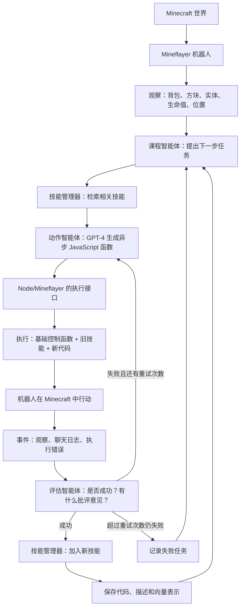
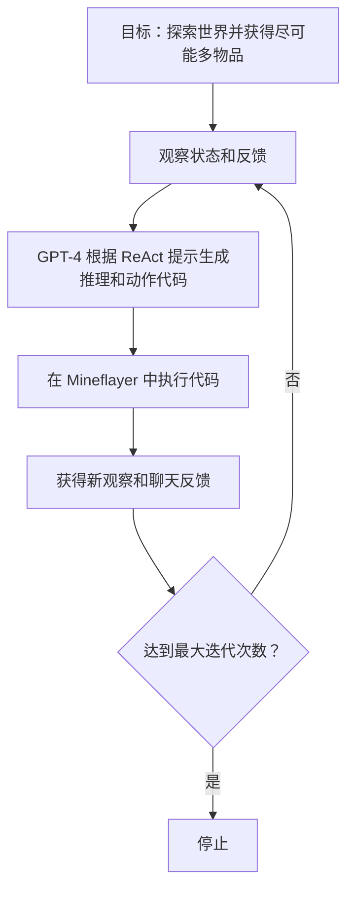
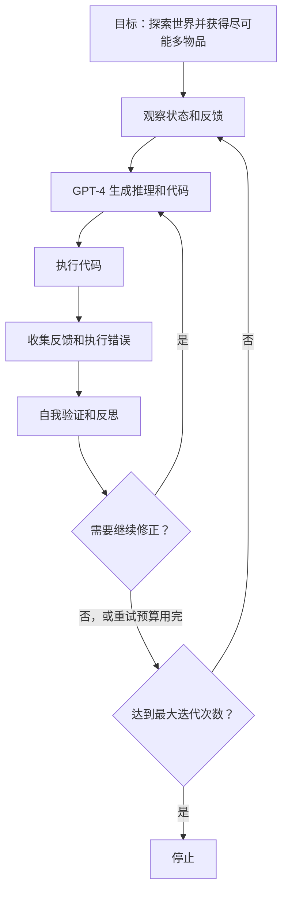
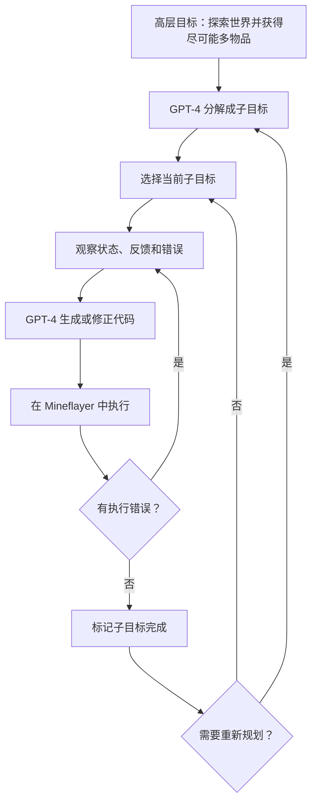

## 原文信息

- 论文：Voyager: An Open-Ended Embodied Agent with Large Language Models
- 作者：Guanzhi Wang, Yuqi Xie, Yunfan Jiang, Ajay Mandlekar, Chaowei Xiao, Yuke Zhu, Linxi Fan, Anima Anandkumar
- 机构：NVIDIA, Caltech, UT Austin, Stanford, ASU
- arXiv：[2305.16291](https://arxiv.org/abs/2305.16291)
- 项目页：[voyager.minedojo.org](https://voyager.minedojo.org/)
- 代码：[MineDojo/Voyager](https://github.com/MineDojo/Voyager)

这篇文章目前更准确地说是 arXiv 预印本（preprint），而不是已经发表在某个会议或期刊上的论文。但它很适合作为大语言模型智能体（LLM Agent）系列里的第三篇：ReAct 定义了智能体如何在环境反馈里行动，Toolformer 讨论模型如何学习调用工具，Voyager 则进一步问：

> 一个大语言模型智能体能不能在开放环境里持续探索，并把成功经验保存成后面可以复用的技能？

> 前两篇可以先看：
>
> - [ReAct 论文阅读：把语言模型从回答器变成会行动的 Agent](/posts/react-paper-reading/)
> - [Toolformer 论文精读：语言模型如何通过自监督学习获得工具使用能力](/posts/toolformer-paper-reading/)
{: .prompt-tip }

## 先说结论

Voyager 的价值不是证明 GPT-4 真的“学会了 Minecraft”。更准确地说，它展示了一种大语言模型智能体能力增长的工程路径：

```text
模型参数不变，
但外部技能库持续增长；
智能体的长期能力被存成可执行、可检索、可组合的程序。
```

这篇文章最重要的不是 Minecraft 演示，而是三个模块如何咬合：

```text
自动课程（automatic curriculum）: 决定下一步学什么。

迭代提示（iterative prompting）: 让 GPT-4 写代码、执行、看错误、继续修。

技能库（skill library）: 把成功代码保存成以后可以检索和调用的技能。
```

如果只用一句话概括 Voyager：

> Voyager 把大语言模型智能体的长期能力从“上下文里的临时推理”外化成了“可检索、可组合、可执行的技能库”。

## 问题设定：不是完成一个任务，而是持续变强

Minecraft 是一个适合做开放式具身智能体（open-ended embodied agent）的环境。它没有唯一终点，地图和资源是开放生成的，智能体需要探索、采集、合成、战斗、升级工具链。

传统具身智能体（embodied agent）或强化学习（RL）方法通常面对几个问题：

- 低层动作空间太大，长程任务很难探索。
- 奖励信号（reward）或示范数据（demonstration）不容易覆盖开放环境。
- 学到的能力可解释性弱，也不容易组合。

大语言模型智能体解决了一部分问题：它有大量世界知识，也会写代码和做计划。但单次提示（prompt）或单次 ReAct 循环仍然不等于终身学习（lifelong learning）。做完一个任务后，如果经验没有沉淀，下一次还是要重新从上下文里想。

Voyager 的目标是让智能体在开放环境中持续获得新能力：

```text
观察当前状态
-> 决定下一步学什么
-> 写程序执行
-> 根据错误修正
-> 成功后保存成技能
-> 下次检索并复用旧技能
```

## 代码作为动作空间是什么意思

这里最容易误解。

普通游戏智能体的动作空间可能是低层动作：

```text
向前走
转头
跳
挖一下
攻击一下
打开背包
```

Voyager 不让 GPT-4 直接输出这些低层动作，而是让 GPT-4 输出 JavaScript 函数，再由 Mineflayer 控制 Minecraft 机器人执行。也就是说，Voyager 的动作（action）不是“一次按键”，而是一段程序。

例如一个技能可能长这样：

```js
async function craftStonePickaxe(bot) {
  const cobblestoneCount = bot.inventory.count(mcData.itemsByName.cobblestone.id);
  const sticksCount = bot.inventory.count(mcData.itemsByName.stick.id);

  if (cobblestoneCount < 3) {
    await mineBlock(bot, "stone", 3 - cobblestoneCount);
    bot.chat("Collected cobblestone.");
  }

  if (sticksCount < 2) {
    await craftItem(bot, "stick", 1);
    bot.chat("Crafted sticks.");
  }

  const craftingTablePosition = bot.entity.position.offset(1, 0, 0);
  await placeItem(bot, "crafting_table", craftingTablePosition);

  await craftItem(bot, "stone_pickaxe", 1);
  bot.chat("Crafted a stone pickaxe.");
}
```

这段代码不是说明书，也不是自然语言记忆，而是真的会被 Node.js 和 Mineflayer 执行。它会查询背包、挖石头、合成木棍、放置工作台、合成石镐。

所以“代码作为动作空间”（code as action space）的意思是：

```text
智能体对环境的动作 = 生成并执行一段程序。
```

这种设计有一个很大的好处：程序天然可以表达长时间、多步骤、可组合的行为。`craftStonePickaxe` 后面可以被更复杂的技能调用，例如 `craftIronPickaxe` 或 `mineDiamond`。

## 环境状态从哪里来

Voyager 不是视觉智能体。它不从屏幕像素里识别牛、树、矿石，而是通过 Mineflayer 接口（API）获得结构化状态。

Mineflayer 会暴露类似这些信息：

```text
bot.entity.position
bot.health
bot.food
bot.inventory.items()
bot.entities
bot.blockAt(...)
```

仓库里的观察（observation）模块会把这些状态整理成提示里的文本，例如：

```text
Biome: plains
Time: day
Nearby blocks: oak_log, dirt, grass_block
Nearby entities: cow, sheep
Health: 20.0/20
Hunger: 20.0/20
Position: x=..., y=..., z=...
Inventory: {"oak_log": 3, "stick": 2}
已完成任务：挖 1 个木头原木
失败任务：挖 5 个铁矿石
```

这意味着 Voyager 的环境接口很强。它更像是：

```text
GPT-4 负责高层决策和代码生成；
Mineflayer 提供结构化状态并执行动作；
Minecraft 服务器返回真实环境变化。
```

这个边界很重要。Voyager 的结果不能直接等同于“视觉具身智能体解决了 Minecraft”。

## 自动课程：下一步学什么

课程（curriculum）可以理解成学习课程或任务顺序。人学数学不会从微积分开始，而是先学加减乘除、方程、函数，再进入更复杂的内容。

Voyager 的自动课程就是让 GPT-4 根据当前状态自动提出下一个阶段性任务。

它不是低层动作：

```text
向前走 3 秒
左转
挖一下
```

也不是一开始给一个巨大目标：

```text
成为 Minecraft 大师
解锁全部技术树
```

它通常是中等粒度的小目标：

```text
Mine 1 wood log
Craft 1 crafting table
Craft 1 wooden pickaxe
Mine 10 cobblestone
Craft 1 stone pickaxe
Mine 5 iron ores
Craft 1 furnace
Craft 1 iron pickaxe
```

代码里第一步甚至被硬编码成 `Mine 1 wood log`。后续任务由课程智能体根据当前观察、已完成任务、失败任务和背包状态生成。

这个设计的价值在于：智能体不需要人类预先写一整条技术树路线，而是每轮根据当前能力边界提出“下一步立即任务”（next immediate task）。

## 迭代提示：不是一次写对，而是边跑边修

GPT-4 一次性写出的代码并不可靠。它可能调用不存在的接口，可能缺材料，可能路径找不到，可能任务完成但没有被识别。

Voyager 的动作智能体不是只生成一次代码，而是在一个任务内最多重试若干轮。每一轮会把这些信息放回提示：

```text
上一轮代码
执行错误
聊天日志
当前观察
评估器给出的批评意见
```

流程大概是：

```text
GPT-4 写异步 JavaScript 函数
-> Mineflayer 执行
-> 收集环境反馈和执行错误
-> 评估器判断任务是否成功
-> 失败则把错误和批评意见塞回提示
-> GPT-4 修代码
```

如果连续几轮还失败，Voyager 会放弃这个任务，把它记入失败任务，然后让课程模块选择下一个任务。这一点很工程化：它不会在单个任务上无限重试，而是给失败一个预算。

## 技能库：长期能力在哪里增长

Voyager 的技能库不是一句“记忆系统”的抽象说法。仓库里它就是一组文件：

```text
skill/code/*.js
skill/description/*.txt
skill/skills.json
skill/vectordb
```

当某个任务成功后，Voyager 会保存：

```text
程序名: 函数名，例如 craftStonePickaxe

程序代码: 可执行 JavaScript 代码

描述: GPT-3.5 根据代码生成的技能描述

向量表示: 描述文本的向量，用来后续检索
```

新任务来了以后，技能管理器会根据当前任务和反馈检索前 k 个相关技能，默认是前 5 个。注意，向量检索本身并不神秘，甚至有点普通；真正重要的是被检索出来的东西不是普通文本，而是可执行代码。

也就是说：

```text
检索输入：当前任务 + 上下文 + 最近反馈

检索对象：已成功技能描述的向量表示

返回内容：对应技能的 JavaScript 代码全文
```

这些旧技能会被塞进 GPT-4 的系统提示（system prompt）。GPT-4 可以在新代码里直接调用旧技能，或者照着旧技能的写法组合出新技能。

这就是 Voyager 的长期能力增长：

```text
模型参数没有变，
但外部技能库越来越厚。
```

论文还通过零样本泛化实验强调了技能库的迁移价值。尤其是 AutoGPT 接入 Voyager 学到的技能库后，完成未见任务的能力也变强了。这说明这些技能不是只绑定在 Voyager 自己的主循环里，而是可以作为外部能力资产，被别的智能体调度器复用。

不过这里的“可迁移”有边界。Voyager 的技能代码仍然高度依赖 Minecraft、Mineflayer、控制原语和结构化观察接口。它能从 Voyager 迁移到 AutoGPT 风格的 Minecraft 智能体，不等于可以直接迁移到机器人、浏览器、手机或图形界面智能体。

## 主流程

用流程图表示，大概是这样：



伪代码可以写成：

```python
def learn():
    reset_world()
    events = env.step("")  # 先拿一次观察结果

    while iteration < max_iterations:
        task, context = curriculum.propose_next_task(
            events=events,
            completed_tasks=completed_tasks,
            failed_tasks=failed_tasks,
        )

        result = rollout(task, context)

        if result.success:
            skill_library.add_new_skill(
                name=result.program_name,
                code=result.program_code,
            )

        curriculum.update_progress(result)
```

单个任务内部：

```python
def rollout(task, context):
    for retry in range(max_retries):
        skills = skill_library.retrieve(task + context + recent_feedback)
        prompt = build_prompt(task, context, observation, skills, critique)

        code = gpt4_generate_javascript(prompt)
        events = mineflayer_execute(code, old_skills=skill_library.programs)

        success, critique = critic.check(events, task, context)
        if success:
            return Success(code)

    return Failure(task)
```

## 两种运行场景

论文主线是终身学习：没有人类给定最终任务，自动课程每轮提出“下一步立即任务”，目标是开放式探索和积累技能库。

仓库里还支持推理模式（inference）：如果人类给一个大任务，例如 `Craft a diamond pickaxe`，Voyager 可以先让 GPT-4 把它拆成多个子目标（sub-goals），然后逐个执行。

这两个场景要分开：

```text
终身学习: 没有固定终局目标；每轮由课程模块根据当前状态提出下一步小任务。

推理模式: 人类给定一个大任务；GPT-4 先分解成子目标，再调用已有技能执行。
```

Voyager 的核心贡献主要在第一个场景。

## 基线方法到底怎么比

论文里的基线方法（baseline）不是原版 ReAct、Reflexion、AutoGPT 直接拿来跑，而是作者为了 Minecraft 环境重新适配的版本。

### ReAct

ReAct 基线的目标是：

```text
explore the world and get as many items as possible
```

它会根据当前观察生成推理过程和动作代码，然后执行，再看反馈继续循环。



它的问题是没有长期技能库，也没有自动课程。面对“尽可能探索世界”这种抽象目标，它容易不知道下一步该学什么。

### Reflexion

Reflexion 可以理解成 ReAct 加反思。失败后，它会基于错误和反馈生成反思，再让下一轮代码修正。



它比 ReAct 多了失败后的语言经验，但这些经验不是可执行程序。下次遇到类似任务时，仍然主要靠上下文重新推理。

### AutoGPT

AutoGPT 基线会先把高层目标拆成子目标，然后逐个执行。



AutoGPT 有任务分解，但没有 Voyager 这种不断增长的技能库。论文还测了一个变体：AutoGPT 加上 Voyager 学到的技能库后，零样本任务求解（zero-shot task solving）会变强。这说明技能库不是只能 Voyager 自己用，也可以作为别的智能体的外部能力资产。

## 实验结果怎么看

论文主要展示四类结果。

第一是探索能力。Voyager 在固定提示迭代次数内发现更多不同物品。这个结果说明自动课程和技能库对开放探索有帮助。

第二是技术树推进。Minecraft 的工具链有明显依赖关系：

```text
wood -> crafting table -> wooden pickaxe -> stone -> stone pickaxe -> iron -> diamond
```

Voyager 能更快推进技术树，说明它不是只在原地刷简单任务，而是在组合旧技能去解锁更复杂能力。

第三是地图移动距离。Voyager 走得更远，说明课程模块也在推动环境探索。

第四是零样本泛化。清空背包、换新世界、给未见过的任务后，Voyager 可以利用之前学到的技能库完成新目标。这里最有意思的是：AutoGPT 加上 Voyager 的技能库后也变强了。这是技能库有迁移价值的证据。

## 消融实验支持了什么

论文的消融实验很值得看，因为它说明 Voyager 不是单纯“提示写得好”。

三个核心模块分别去掉后，会塌不同部分：

```text
没有自动课程: 不知道下一步该学什么，探索顺序会乱。

没有技能库: 成功经验不能复用，后期能力容易停滞。

没有迭代提示: 一次性代码生成经常失败，也容易把错误代码当成技能。
```

反馈类型里，自我验证（self-verification）很关键。因为它决定任务是否真的完成、是否可以把代码加入技能库。如果评估器误判，错误技能就可能进入长期记忆。

这也是 Voyager 的一个深层风险：长期记忆越有用，错误记忆的伤害也越大。

## 从审稿人角度看

如果把这篇当作系统论文看，可以给比较正面的评价。它的问题选得好，系统抽象清楚，开源实现也让人能看到它不是纯概念图。

但它不是严格意义上的算法突破。单个模块都不算全新：

- 课程是用 GPT-4 生成任务；
- 技能检索是描述文本的向量检索；
- 迭代提示是代码生成、执行、修正；
- 评估器也是由大语言模型判断成功与否。

它真正的贡献是把这些模块组织成一个能运转的终身学习智能体脚手架。

可以这样评价：

```text
新颖性: 中等偏强。模块不是全新，但组合方式清楚、有影响力。

重要性: 强。它给出了一种理解大语言模型智能体长期能力增长的工程范式。

可靠性: 中等。实验支持主张，但基线适配、公平性和环境接口强度都需要保留意见。

可复现性: 中等偏强。代码开源，但依赖 GPT-4、Minecraft、Mineflayer，复现成本不低。
```

## 这篇的边界

第一，Voyager 的“学习”不是参数更新。GPT-4 没有变，变化的是外部技能库。所以更准确地说，它是外部记忆式终身学习（external-memory lifelong learning）。

第二，环境接口很强。它通过 Mineflayer 直接拿到附近实体、方块、背包、位置等结构化状态，不是从视觉里感知世界。

第三，GPT-4 先验混入很深。自动课程、任务上下文、代码生成、评估器都依赖 GPT-4 对 Minecraft 的知识。系统到底从环境探索中学了多少，和 GPT-4 本来知道多少，并没有完全分开。

第四，基线公平性有限。ReAct、Reflexion、AutoGPT 都是作者适配到 Minecraft 的版本，不一定代表这些方法的最强实现。

第五，工程辅助很多。代码里有重置、保留背包、归还物品、恢复工作台和熔炉等操作。这些对实验合理，但也说明它不是完全原生的生存模式设定。

第六，Voyager 抽象出了可复用技能库，但没有进一步抽象出统一的技能执行运行时。比如“执行任何技能时都要周期性检查附近威胁、血量、食物、工具损耗，必要时中断当前任务、逃跑、恢复、再继续”，这类逻辑并没有变成统一的 wrapper 或 hook。它主要依赖单个技能代码自己写好安全处理，或者等失败后再让 GPT-4 根据反馈修正。

这会带来几个工程问题：

```text
重复：每个技能都可能重复写检查敌人、吃东西、找路逻辑。

不一致：有的技能会处理僵尸，有的不会。

不可控：安全策略散落在 GPT-4 生成的代码里，不容易全局审计。

难恢复：没有标准化的“中断后恢复原任务”协议。
```

所以 Voyager 更像是“生成可复用程序库”，还不是一个带统一运行时守护机制的智能体操作系统。

## 有没有后续工作

Voyager 没有一个公认的 “Voyager 2” 式官方续作，但它确实影响了后续几条线。

一条是多智能体协作，例如 [MindForge / CollabVoyager](https://arxiv.org/abs/2411.12977)，它把 Voyager 的单智能体开放式学习扩展到多个智能体共享经验、沟通和纠错。

一条是多模态 Minecraft 智能体，例如 [JARVIS-1](https://arxiv.org/abs/2311.05997) 和 [MP5](https://arxiv.org/abs/2312.07472)。这类工作更强调视觉观察、多模态感知和更接近人类玩家的输入，而不是只依赖结构化状态和高层接口。

最近的 [Agentopia](https://arxiv.org/abs/2606.07513) 和 Voyager 也都谈长期智能体，但关系不算直接。Voyager 是具身智能体的技能库增长；Agentopia 更接近 Generative Agents 那条智能体社会、社会模拟和 life reward training 线。

还有一条更系统的后续方向，不是 Voyager 的直接续作，但正好在补它缺的运行时层：智能体运行时治理（runtime governance）和运行时约束（runtime enforcement）。

这类工作关心的不是“技能怎么生成”，而是：

```text
技能执行前：检查权限、资源、环境状态。

技能执行中：持续监控风险、威胁、策略约束和工具调用边界。

发现异常：中断当前动作、回滚、要求人类确认，或切换到恢复策略。

异常结束后：恢复原任务，或者安全放弃。
```

比如 [AgentSpec](https://arxiv.org/abs/2503.18666) 用规则语言描述运行时约束，把 trigger、predicate、enforcement 这类检查做成显式规则；[Pro2Guard](https://arxiv.org/abs/2508.00500) 进一步尝试提前预测继续执行是否会进入危险状态，而不是等危险已经发生再拦截；[Harnessing Embodied Agents](https://arxiv.org/abs/2604.07833) 明确把策略检查、能力准入、执行监控、回滚和人工接管外置成运行时治理层。

OpenClaw 生态里的安全工作也在走类似方向。[ClawGuard](https://arxiv.org/abs/2604.11790) 把工具调用边界变成确定性检查点，防止间接提示注入影响真实工具调用；[ClawKeeper](https://arxiv.org/abs/2603.24414) 则提出通过 skill、plugin、watcher 三层保护 OpenClaw 智能体，其中 watcher 更接近一种和智能体内部逻辑解耦的运行时监控层。

从这个角度看，Voyager 解决的是：

```text
成功行为如何沉淀成技能。
```

后续运行时治理工作补的是：

```text
技能执行时如何被统一监控、约束、中断、恢复和审计。
```

所以 Voyager 的后续影响可以概括为：

```text
它没有解决全部 embodied agent 问题，
但留下了一个很清楚的系统脚手架：
自动课程 + 可执行技能库 + 执行反馈。
```

## 和 OpenClaw Skill 的关系

这里可以顺手对比一下 Voyager 的 skill 和 OpenClaw 里的 Skill。按照 OpenClaw skill 相关论文的说法，智能体技能可以包含可复用的指令、工具、脚本、参考资料和工作流，例如 [ClawHub Security Signals](https://arxiv.org/abs/2606.01494) 讨论的 `SKILL.md` 内容和打包文件，[Clawdrain](https://arxiv.org/abs/2603.00902) 也把攻击面放在 `SKILL.md` 指令和配套脚本上。最近的 [OpenClaw-Skill](https://arxiv.org/abs/2606.16774) 则进一步把 skill 当成可以被自动构造、组合和评估迁移性的技能树节点。

二者的共同点是：

```text
都把能力放在模型参数之外；
都让智能体通过检索或加载外部技能来扩展能力；
都把技能做成可以跨任务复用的资产；
都带来安全和可靠性问题，因为技能一旦被调用，就会影响真实行动。
```

但区别也很大。

Voyager 的 skill 是在探索过程中自动生成出来的成功代码。它的来源是：

```text
任务成功
-> 保存这次成功的 JavaScript 函数
-> 生成描述和向量
-> 后续检索并组合调用
```

所以 Voyager 的 skill 更像“经验沉淀”：智能体先做成一件事，再把做成这件事的代码保存下来。

OpenClaw 的 Skill 更像“能力插件”或“操作手册”。它通常由人、社区或专门的技能构造流程提前写好，告诉智能体如何使用某个工具、服务或工作流，例如邮箱、日历、浏览器、文件系统、自动化脚本等。它不一定来自单个智能体自己的探索成功轨迹，而是部署前或运行中安装进来的外部能力包。

可以压成一个对比：

| 维度 | Voyager skill | OpenClaw Skill |
| --- | --- | --- |
| 来源 | 智能体探索成功后自动保存 | 人或社区提前编写、安装、维护 |
| 形式 | 可执行 JavaScript 函数 + 描述 + 向量 | `SKILL.md` 指令、依赖、脚本、资源 |
| 主要用途 | 在 Minecraft 里复用和组合动作技能 | 让个人智能体接入真实工具和工作流 |
| 学习含义 | 外部记忆随探索增长 | 能力随安装和维护扩展 |
| 风险 | 错误技能入库、错误检索、环境依赖强 | 权限过大、恶意技能、提示注入、供应链风险 |

所以二者的联系是：它们都说明“智能体能力不必只存在于模型参数里”。区别是：Voyager 更关心技能如何从环境交互中长出来；OpenClaw 更关心技能如何作为工程扩展包被分发、安装和执行。

## 总结

Voyager 的核心贡献不是“GPT-4 会玩 Minecraft”，而是把长期能力增长做成了一个可以运行的系统结构。

它把开放环境里的智能体学习拆成了三个互相依赖的问题：

```text
下一步学什么：自动课程负责提出阶段性任务。

怎么把任务做成：迭代提示负责生成代码、执行、修错。

成功经验放在哪里：技能库负责保存、检索和组合可执行技能。
```

这篇文章最值得带走的是一个更一般的智能体设计思想：

> 能力不一定只存在于模型参数里，也可以存在于外部、可检索、可执行、可组合的技能库里。

这件事对后面的 Generative Agents、MemGPT、MCP 和智能体可靠性都有连接意义：智能体的长期能力到底应该放在哪里，如何被检索，如何被验证，错误记忆如何避免污染系统，这些问题都会反复出现。
