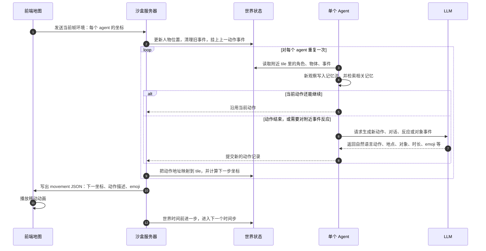

## 原文信息

- 论文：Generative Agents: Interactive Simulacra of Human Behavior
- 作者：Joon Sung Park, Joseph C. O'Brien, Carrie J. Cai, Meredith Ringel Morris, Percy Liang, Michael S. Bernstein
- 发表：UIST 2023，ACM Symposium on User Interface Software and Technology
- arXiv：[2304.03442](https://arxiv.org/abs/2304.03442)
- 项目页：[generative-agents.github.io](https://generative-agents.github.io/)
- 代码：[joonspk-research/generative_agents](https://github.com/joonspk-research/generative_agents)

Generative Agents 讨论的不是“能不能让大语言模型（LLM）扮演一个角色”，而是一个更具体的问题：如果把许多角色放进一个持续运行的小镇里，它们怎样根据过去经历、当前环境和未来安排来行动，并让旁观者觉得这些行为是连贯的。

论文用“可置信”（believable）描述这种效果。这里的可置信不是说 agent 的行为真实、正确或可靠，而是说它看起来符合角色经历、当前情境和社会关系。比如一个角色昨天听说了情人节派对，今天会记得这件事、邀请别人、调整自己的日程；另一个角色听到消息后，也可能把这个消息继续传播出去。

为了让这种连续性可以工程化，论文没有只依赖一段更长的角色设定 prompt，而是把 agent 的行为生成拆成三个相互依赖的机制：记忆流（memory stream）、反思（reflection）和规划（planning）。

这三个机制分别回答长期 Agent 的三个基础问题：过去经验如何保存和检索；零散经历如何被抽象成更高层认识；下一步行为如何同时受记忆、日程和环境反馈影响。

## 论文要解决的问题

大语言模型已经可以在一个局部上下文里生成像人的行为或对话，但这不等于它能长期维持一个角色。一个长期存在的角色至少要处理几件事：

- 它昨天见过谁、聊过什么，今天还要记得。
- 它不能每半小时吃一次午饭，因为每次只看当前状态都会觉得“现在吃饭也合理”。
- 它要能从零散事件中形成更高层判断，比如“这个人和我有共同研究兴趣，所以我更可能想和他深入交流”。
- 多个 agent 在同一个小镇中互动时，信息要能传播，关系要能变化，活动要能协调。

Smallville 是论文构建的沙盒小镇。里面有 25 个 agent，有咖啡馆、学校、公园、商店、宿舍和住处。用户可以观察它们，也可以用自然语言干预某个 agent，比如告诉 Isabella 她想组织情人节派对。后续邀请传播、装饰咖啡馆、有人约别人一起参加、最后部分 agent 到场，都不是逐条手写脚本，而是由 agent 架构推动出来。

这里有一个边界要先说清楚：这些 agent 不具备真正的人类主体性。论文中说 agent 行动、聊天、参加派对，是为了描述方便。更准确地说，这是一套让 LLM 角色在结构化环境中持续生成可置信行为的系统。

## 三个机制

### 记忆流

记忆流是每个 agent 的长期经验记录。每条记忆是自然语言形式，带有创建时间、最近访问时间和重要性分数。最基础的记忆是观察（observation），例如：

```text
Maria Lopez is studying for a Chemistry test while drinking coffee
```

从系统设计上看，记忆不只是一个长列表。它至少包含三类状态：

- 经验记忆：agent 观察到的事件、对话和反思。
- 空间记忆：agent 见过哪些地方和物体。
- 短期工作状态：当前时间、当前位置、日程、当前动作、聊天状态、路径等。

检索也不是把所有记忆都塞进 prompt，而是按三个维度打分：

- 近期性（recency）：越近期访问过的记忆越容易被取出。
- 重要性（importance）：由语言模型给记忆打 1 到 10 的重要性分。
- 相关性（relevance）：用 embedding 相似度衡量当前情境和记忆的相关程度。

可以简化理解为：

```text
score = recency + importance + relevance
```

论文给 Isabella 的例子能说明为什么不能只做粗暴总结。假设问 Isabella “最近你热衷什么”，如果把她所有经历压缩成一个泛泛摘要，答案可能会变成“她关心活动、项目、咖啡馆整洁”之类，很空。检索模块的目标是把和当前问题最相关的记忆拿出来，比如她在计划情人节派对、想让人们感到受欢迎、想营造大家能享受的氛围。这样答案才会具体到她的真实经历，而不是一个通用角色设定。

### 反思

反思解决的是“只有原始观察不够”的问题。

论文里有一个很好的例子。Klaus Mueller 被问到：“如果要从认识的人里选一个人共度一小时，会选谁？”如果只有原始观察记忆，agent 很容易选 Wolfgang，因为 Klaus 和 Wolfgang 见面次数最多。但这些见面大多只是宿舍邻居之间的擦肩而过，并不代表深层关系。更合理的选择可能是 Maria：Klaus 花很多时间做研究，Maria 也在投入自己的研究，二者虽然领域不同，但有共同的研究兴趣。

这个例子说明，反思不是“再总结一下记忆”。它要把很多低层观察变成高层判断：

```text
Klaus 在读 gentrification 相关书籍
Klaus 和图书馆员讨论研究项目
Klaus 长时间写研究论文
Maria 也在投入自己的研究
-> Klaus 很重视研究
-> Klaus 和 Maria 有共同兴趣
-> 如果要找人深入交流，Maria 比擦肩而过的 Wolfgang 更合适
```

论文的反思机制大致分三步。

第一步是触发反思。系统不是每条观察都立刻反思，而是等最近事件的重要性累计超过阈值。论文实现中阈值是 150，实际大约每天反思两到三次。

第二步是生成“该反思什么问题”。系统会拿最近 100 条记忆，让语言模型提出几个最重要的高层问题。例如：

```text
Klaus Mueller 对什么主题有热情？
Klaus Mueller 和 Maria Lopez 是什么关系？
```

第三步是用这些问题去检索相关记忆，再让语言模型生成 insight，并要求它指出证据来自哪些记忆。生成出来的 insight 会写回记忆流。也就是说，反思不是一个独立数据库，而是一种新类型的记忆，后续检索时会和观察、对话、计划一起被取出来。

论文的消融实验也能看到反思的价值。Maria 被问到 Wolfgang 生日可以送什么礼物时，如果没有反思，她只能说自己不确定 Wolfgang 喜欢什么；有反思记忆后，她能说 Wolfgang 对 mathematical music composition 感兴趣，所以可以送和音乐创作相关的书或软件。

### 规划与反应

规划解决的是时间一致性问题。如果每个时间点都只问 LLM “现在 Klaus 该做什么”，它可能 12 点吃午饭，12 点半又吃午饭，1 点再吃一次午饭。因为单步生成只追求当前合理，不保证整天连贯。

论文的做法是先生成日级计划，再递归拆成更细粒度计划：

```text
一天的大计划 -> 小时级日程 -> 5 到 15 分钟级动作
```

论文里的 Klaus 例子很直观。没有长期计划时，模型在每个时间点都觉得“现在吃午饭”是合理的，于是会重复吃午饭。有计划之后，Klaus 中午在 Hobbs Cafe 吃饭并阅读，下午 1 点去学校图书馆写研究论文，下午 3 点去公园散步。这里计划的作用不是让行为更“聪明”，而是让行为在时间上不自相矛盾。

反应（reacting）处理环境中的突发事件。每个时间步 agent 会感知附近事件，把新事件写入记忆，并判断是否要继续原计划、聊天、等待或对事件作出反应。受控评估里会问 agent：“早餐烧焦了怎么办？”一个合理反应是先关火，避免继续烧，再检查发生了什么。还会问“浴室被占用了怎么办？”合理反应是等一会儿，或者找替代方案。

所以，Generative Agents 的核心不是某一个 prompt，而是这三个机制之间的咬合：

```text
观察写入记忆 -> 检索相关经验 -> 反思形成高层认识 -> 规划约束未来行为 -> 每个时间步再根据环境反应
```

## Smallville 不是纯 prompt 世界

Smallville 不是一个只在 prompt 里想象出来的小镇。它有前端地图、角色 sprite、坐标、碰撞、物体、事件和服务器维护的 JSON 状态。更准确地说，它是一个**由程序承载、由 LLM 推动语义演化的社会模拟世界**。

程序承载的是世界的硬结构：地图长什么样、哪里能走、角色在哪个坐标、对象在哪个格子、每个时间步怎么推进、前后端怎样交换状态。

LLM 推动的是世界的语义进程：角色现在想做什么、某个动作应该发生在哪里、对象被使用后呈现什么状态、其他 agent 看到事件后如何解释和反应。

### 地图、tile 与局部感知

地图不是一张纯图片，而是由许多地图格子（tile）组成。这里的 tile 可以理解成 2D 游戏地图上的最小网格单元，类似棋盘上的一个格子：它有自己的 `(x, y)` 坐标，系统也知道这个格子属于哪个地点、上面有没有物体、能不能走过去、当前发生了什么事件。

论文里把空间组织成树状层级：

```text
world -> sector -> arena -> game_object
```

比如 Hobbs Cafe 里有 cafe、kitchen、counter、coffee machine 这类区域和对象。agent 不需要从像素里识别“这里有咖啡机”；环境本身就知道某个格子属于哪个区域、上面有什么对象。

agent 也不是全知的。它只看自己附近一定范围内的格子；如果附近事件太多，还会按距离和注意带宽筛掉一部分。已经在短时间内反复看过的同一个事件，也不会每个时间步都重复写入记忆。这样得到的世界状态是局部的、逐步积累的，而不是上帝视角。

### Action space：自然语言动作语义 + 沙盒可执行地址

Generative Agents 的动作空间（action space）不是键盘鼠标，也不是像 Voyager 那样生成一段可执行代码。它更像是：

```text
自然语言动作语义 + 沙盒可执行地址
```

这里容易混淆的一点是：下面这些字段不是角色 agent 一次性“提交给世界”的原始动作，而是系统内部为了执行这个动作而生成和保存的动作记录。agent 最核心的输出是动作语义，比如 `making espresso for a customer`，以及它在日程里的持续时间；后面的目标地址、目标物体、emoji、事件三元组、对象状态变化，是系统继续用环境树、沙盒状态和若干 LLM 查询补全出来的。

```text
Agent 动作语义 -> 系统内部动作记录 -> 沙盒执行
```

一个普通对象动作最后会被保存成几类字段：

- `act_description`：动作语义，比如 `making espresso for a customer`、`writing in her journal`、`checking her emails`。
- `act_duration`：动作持续多少分钟，来自细粒度日程。
- `act_address`：动作发生在哪里，形式类似 `world:sector:arena:game_object`。比如 `the Ville:Hobbs Cafe:cafe:coffee machine`。
- `act_pronunciatio`：界面上显示的 emoji，用来从俯视视角快速表示行为。
- `act_event`：人物事件三元组，比如 `(Isabella, making, espresso)` 或 `(Klaus, chat with, Maria)`，用于让这个动作变成其他 Agent 可感知、可检索的事件。
- `act_obj_event`：对象事件三元组，比如 coffee machine 的状态变化，用于让物体状态也进入世界状态。

执行层还写好了几类特殊地址：

- `<persona> name`：人物交互动作。比如要和 Maria Lopez 聊天时，目标地址不是咖啡机或桌子，而是 `<persona> Maria Lopez`。
- `<waiting> x y`：等待动作。Agent 暂时停在某个坐标，等另一个人的动作完成后再继续。
- `<random>`：随机地点动作。执行层会在某个地址范围内随机抽一个候选格子。
- 普通地址 `world:sector:arena:game_object`：对象/地点动作。比如去 Hobbs Cafe 的 coffee machine 做咖啡。

这说明 Smallville 的 action space 不是“LLM 想说什么都能执行”。LLM 生成动作语义，但执行层只接受对象地址、人物地址、等待地址、随机地址这些形态。它没有把所有行为写成几十个固定枚举动作，但也不是完全开放的自然语言动作空间。

如果 LLM 生成了不存在的地点或物品，系统不会凭空创造它。限制大致分三层：

- 生成地点时，prompt 会把 agent 已知、可访问的 sector / arena 列出来，让 LLM 在这些候选项里选。这是软约束。
- 选择 sector 时，代码会检查输出是否在可访问 sector 里；如果不在，就退回到角色的居住区域。
- 选择 game object 时，代码会把当前 arena 中可访问的对象列表给 LLM；如果 LLM 输出了列表外对象，代码会随机换成一个真实存在的可访问对象。
- 执行时，最终地址必须能在 `address_tiles` 里查到候选地图格子。当前仓库代码里，这一层的异常处理很粗糙：如果地址不存在，会进入未优雅处理的错误分支。

论文里有一个例子能说明这个过程。Eddy Lin 想“在工作区附近散步”。系统不是直接让 LLM 发明一个地点，而是先把 Eddy 当前所在环境和他知道的地点展开成自然语言：他在 Lin 家，房子里有 Eddy 的卧室、公共房间、厨房、浴室、花园；他还知道 Johnson Park、Harvey Oak Supply Store、Willows Market and Pharmacy、Hobbs Cafe、Rose and Crown Pub。prompt 里还加了一条规则：如果当前区域能完成这个活动，优先留在当前区域。

接下来 LLM 先选择大区域，输出 The Lin family's house；系统再用同样方式递归选择更细的子区域，最后落到：

```text
The Lin family's house:garden:house garden
```

然后 LLM 的工作基本结束，沙盒执行层接管：这个地址会被映射到地图上的候选格子，再用传统路径算法让 Eddy 移动过去。这个例子说明了 action space 的边界：LLM 参与“这个动作语义上应该发生在哪里”的判断，但它是在候选地点和已知空间树里选择；真正的移动、碰撞、坐标路径不是 LLM 生成的。

### 对象状态：更像事件，不是完整状态机

对象状态更新确实有 LLM 驱动的部分。论文里的例子是：如果 Isabella 执行“为顾客制作 espresso”，系统会询问语言模型这个动作会如何影响对象状态，然后把 Hobbs Cafe 里咖啡机的状态从 `off` 改成 `brewing coffee`。论文在服务器状态描述处也用了类似例子，把 coffee machine 从 `idle` 改成 `brewing coffee`。

但这里的“对象状态”不要理解成传统游戏里的完整状态机。代码里更接近“对象事件”：地图格子上默认挂着一个空事件，比如 `(coffee machine, None, None, None)`；当某个 agent 到达目标地点并使用对象时，系统把 LLM 生成的对象描述和事件三元组挂到这个格子上；下一轮循环又会把上一轮对象事件清回空事件。也就是说，`brewing coffee` 或 `broken` 更像一条可被附近 agent 感知到的自然语言事件，而不是一个会自动约束后续交互的持久物理状态。

如果生成了“破坏咖啡机”，系统可能会把 coffee machine 的对象事件写成 `broken` 一类描述；但除非后续 prompt、记忆检索或额外代码继续利用这个事件，否则沙盒本身不会自动获得“咖啡机不可用”“需要维修”“不能再制作 espresso”这些硬规则。

类似地，如果一台咖啡机正在被使用，又有人想去做咖啡，系统也没有对象级硬锁。路径层会尽量避免人物站到同一个格子；反应层可能让后来者等待或聊天；但这不是由 coffee machine 的互斥状态触发的严格排队机制，而是由 agent 感知事件后再用 LLM 判断该怎么反应。

### 一个时间步如何运行

论文的实现不是让 25 个 agent 在一个 prompt 里同时“想象”小镇，而是用一个沙盒服务器维护世界状态。服务器保存一份 JSON 状态，里面有每个 agent 的当前位置、当前动作描述、正在交互的对象、聊天状态和世界时间。前端负责地图、sprite、碰撞图和动画，后端负责让每个 agent 感知、计划、反应并输出下一步动作。

一个时间步大致这样走：

1. 前端把当前环境状态写给后端：每个 agent 现在在哪个地图格子。
2. 后端把 agent 从旧格子移到新格子，并把它当前的事件挂到新位置。
3. 如果 agent 已经走到目标地点，后端把对象事件也挂到格子上，比如咖啡机正在煮咖啡。
4. 每个 agent 只读取视野范围内的人、物体和事件，把新的观察写入记忆流。
5. agent 基于记忆检索、计划、反应和对话模块，决定当前动作是否继续，还是生成新动作。
6. 执行层把新动作转换成下一步坐标、emoji 和动作描述。
7. 后端把所有 agent 的下一步 movement 写回 JSON，前端读取后播放移动和展示 emoji。
8. 世界时间前进一步，然后进入下一个时间步。

更直观地说，一个时间步不是“25 个 agent 同时在一个 prompt 里聊天”，而是后端在当前世界状态上逐个处理 agent，然后一次性写出下一帧移动结果。LLM 只介入动作语义、对话、反应和对象事件解释；坐标、碰撞、路径和时间推进仍然由程序处理。



所以这里的“环境状态”不是从屏幕像素识别出来的，而是由游戏沙盒提供的结构化状态。agent 知道附近有哪些事件、地点、对象，来自环境引擎的数据结构，而不是视觉模型。

这也解释了“这个世界是不是由 LLM 驱动”的问题：如果说地图、时间步、坐标、碰撞、路径移动，那它不是 LLM 驱动；如果说“发生了什么事”“对象状态如何被解释”“角色如何回应事件”，那它很大程度上由 LLM 驱动。Smallville 的关键形态不是纯 LLM 世界，也不是传统硬规则游戏世界，而是程序提供世界骨架，LLM 推动语义事件流。

## 评估：它证明了什么，又没证明什么

论文的评估目标不是游戏得分，而是行为可置信度。作者让 agent 在两天模拟后接受访谈，问题分成五类：自我认知、记忆、计划、反应、反思。

这些问题不是泛泛问“你好吗”。论文附录里能看到具体问法，例如：

```text
你今天早上 6 点会在做什么？
谁在竞选镇长？
情人节派对发生了吗？
早餐烧焦了，你会怎么办？
如果你要和最近聊过的人共度时间，会选谁，为什么？
```

这些问题分别压测不同能力：问 6 点在做什么，测试计划是否稳定；问镇长竞选和派对，测试记忆检索；问早餐烧焦，测试反应；问想和谁共度时间，测试反思是否能把经历综合成关系判断。

这里的“可置信度”不是一个自动指标，也不是让评估者给每个回答打 1 到 5 分。论文招募了 100 位人类评估者，让他们观看某个 agent 在 Smallville 中两天生活的 replay，并查看这个 agent 的记忆流。然后，评估者会看到同一个问题下五种条件生成的回答：完整架构、几个消融架构，以及人类众包写出的回答。评估者要做的是把这些回答按“最可置信”到“最不可置信”排序。

论文再把这 100 组排序数据转成 TrueSkill 评分。TrueSkill 可以理解成 Elo 等级分在多人排序场景下的扩展：它根据“哪个条件在排序里压过哪个条件”来估计每个条件的均值和方差。所以下表里的 TrueSkill 均值不是准确率、概率或绝对可信度，而是相对排序分数。分数越高，表示这个条件的回答在人工比较中越常被认为更可置信。

受控评估比较了完整架构和几个消融版本：

| 条件 | TrueSkill 均值 |
| --- | --- |
| 完整架构 | 29.89 |
| 无反思 | 26.88 |
| 无反思、无计划 | 25.64 |
| 人类众包基线 | 22.95 |
| 无观察、无计划、无反思 | 21.21 |

这个结果支持论文主张：记忆、计划、反思不是随便堆上去的 prompt 工程，每去掉一层，可置信度都会下降。

但人类众包基线低于完整架构，不能简单理解成“LLM 比人更会扮演人”。论文自己也说，这个基线不是专家级人类上限，只是一个基本行为能力参照。众包 worker 需要在有限时间里看 replay 和记忆再回答，条件本身并不代表真正的人类最优表现。

这里还有一个容易忽略的实验设计细节：消融条件不是重新跑一遍两天模拟，而是在完整架构跑出来的同一段经历上，限制回答时能访问的记忆类型。这样做的好处是不同条件面对的是同一批经历，方便比较；坏处是它没有展示“如果从一开始就没有反思/计划，整个小镇轨迹会变成什么样”。所以这个实验更像是回答“这些模块对访谈回答的可置信度有多重要”，而不是完整证明“这些模块对整个社会模拟轨迹有多重要”。

端到端评估让 25 个 agent 在 Smallville 中连续互动两个游戏日，观察三个社会层面的结果：

- 信息传播：Sam 竞选镇长和 Isabella 组织情人节派对这两条消息，初始时只有发起者知道。两天后，知道 Sam 竞选的 agent 从 1 个增加到 8 个；知道派对的 agent 从 1 个增加到 13 个。
- 关系形成：作者用 agent 是否互相知道对方来构造社交网络，网络密度从 0.167 增加到 0.74。
- 协作：Isabella 邀请别人参加派对，最终 12 个被邀请者中有 5 个到场。

这些结果说明系统确实能产生跨 agent 的级联行为。但它也暴露出错误边界：

- 检索失败：agent 明明听过某个消息，但回答时没取出相关记忆。
- 记忆片段不完整：agent 记得“要在派对上聊选举”，却不确定派对是否存在。
- 语言模型润色式幻觉：很少完全编造，但会给记忆添加不可靠的细节。
- 过度礼貌和合作：模型的 instruction tuning 会让角色对别人建议过于顺从，不够像真实人类。
- 环境理解有限：agent 可能不能稳定处理空间、对象和可见性中的细节。

论文里的失败案例很有信息量。Rajiv 听说过 Sam 要竞选，但被问到本地选举时，他回答自己没有太关注。这不是因为记忆完全不存在，而是相关记忆没有被取出来。Tom 被问到 Isabella 的情人节派对时，说自己不确定是否真的有派对，但又记得如果派对发生，他要和 Isabella 聊镇长选举。这说明他取出了“在派对上聊选举”的记忆，却没有取出“有人告诉他派对存在”的记忆。

还有一种是润色式幻觉。Isabella 知道 Sam 要竞选，这点是对的；但她还补了一句 Sam 明天会宣布，实际上她和 Sam 没讨论过这个计划。Yuriko 也把邻居 Adam Smith 描述成写过《国富论》的经济学家，这显然是语言模型把历史人物 Adam Smith 的知识混进了角色记忆。

这些错误说明，Generative Agents 的失败点不只来自 LLM 本身，也来自记忆检索、环境表示和行为执行层之间的接口。

## 和 Voyager 的区别

Generative Agents 和 Voyager 都关心“单次 prompt 不够”的问题，但它们保存经验的形式不同。

| 维度 | Voyager | Generative Agents |
| --- | --- | --- |
| 环境 | Minecraft | Smallville 小镇 |
| 长期积累对象 | 可执行 JavaScript 技能 | 自然语言记忆、反思、计划 |
| 目标 | 开放探索和能力增长 | 可置信社会行为 |
| 动作表示 | 程序代码 | 自然语言动作描述 + 沙盒执行 |
| 反馈方式 | 执行结果、错误、环境状态 | 感知事件、对话、日程变化 |
| 成功标准 | 解锁更多物品、技能迁移、探索能力 | 行为可置信、信息传播、关系形成、协作 |

因此，Generative Agents 不应该被理解成 Voyager 的“社交版”。它们都属于 LLM Agent 的长期性探索，但一个强调技能库，一个强调记忆流。

更抽象地说：

```text
Voyager 的长期能力 = LLM 先验 + 成功代码技能库
Generative Agents 的长期行为 = LLM 先验 + 自然语言经验记忆 + 反思 + 计划
```

## 如何评价这篇论文

评价这篇论文时，优点应放在系统组合上，而不是单个 prompt。

它的强点是：

- 问题设定清楚：目标不是通用智能，而是长期可置信行为。
- 架构有解释力：记忆、反思、规划三个模块分别对应长期连续性的不同缺口。
- 演示有说服力：Smallville 虽然是小环境，但 25 个 agent 的信息传播和派对协调确实直观。
- 消融实验有价值：去掉观察、计划、反思会逐步降低可置信度，说明模块组合不是纯装饰。
- HCI 视角鲜明：它不是只追求 benchmark 分数，而是讨论交互系统里如何使用这种模拟角色。

它的弱点也明显：

- 评估指标偏主观，可置信度依赖人类排序，难以覆盖可靠性、真实性和任务成功。
- 众包人类基线不能代表人类上限，因此“超过人类基线”不宜过度解读。
- 环境是高度结构化沙盒，不是从真实视觉世界中学习状态。
- 记忆检索是核心瓶颈，检索错了就会出现似是而非的回答。
- 成本太高，25 个 agent 两天就需要很高 token 成本，扩展到更大社会会遇到系统瓶颈。
- 社会行为的“涌现”程度需要谨慎理解，因为初始人物设定、地点 affordance、prompt 链、检索规则和日程规则都提供了很强结构。

可以这样概括：

> 这篇论文的贡献不是证明 LLM 拥有真实社会智能，而是提出并验证了一个可运行的 agent 架构，使 LLM 角色在结构化小镇中表现出一定长期连贯性和社会互动可置信度。

## 后续影响

Generative Agents 影响了一批“多智能体社会模拟”和“长期记忆 agent”的工作。它可以被看作“记忆、反思和规划支撑长期行为”的代表节点。后续大致有几条线。

第一条是多智能体社会模拟。很多工作沿着 Smallville 的方向继续做更大规模、更复杂互动、更可控的社会仿真。最近一些论文也会把 Generative Agents 当作社会模拟式 LLM Agent 的起点。

第二条是长期记忆与上下文管理。Generative Agents 把经历存在外部记忆里，再检索进上下文。后续很多工作继续追问：记忆如何写入、如何压缩、如何检索、如何避免错误记忆污染后续行为。

第三条是交互式 NPC 和游戏 agent。游戏行业和研究工作都开始关注用 LLM 生成 NPC 的日程、对话、关系和任务反应，但工程上通常还需要更强的安全控制、剧情约束和状态机。

第四条是可信与安全。论文里已经提到提示注入、记忆污染、拟人化依赖、定制化说服等风险。后续如果把这种 agent 放进真实产品，记忆写入权限、审计日志、人格边界和用户误导都会变成系统问题。
