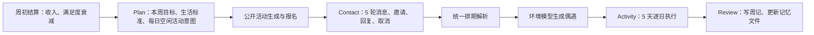
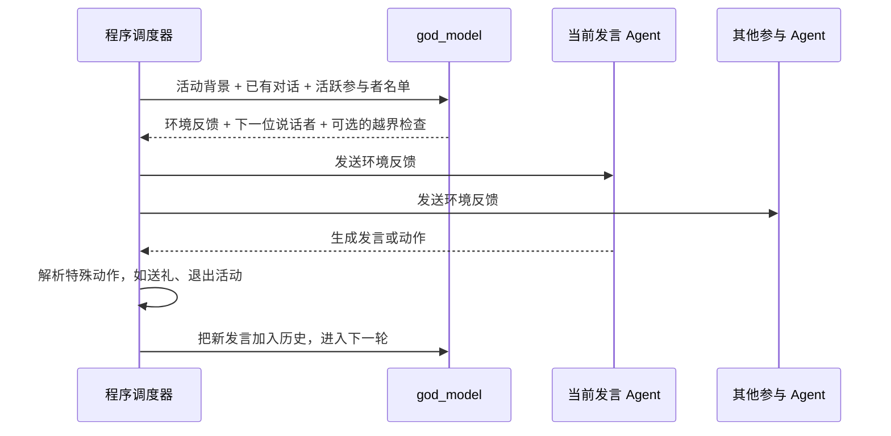
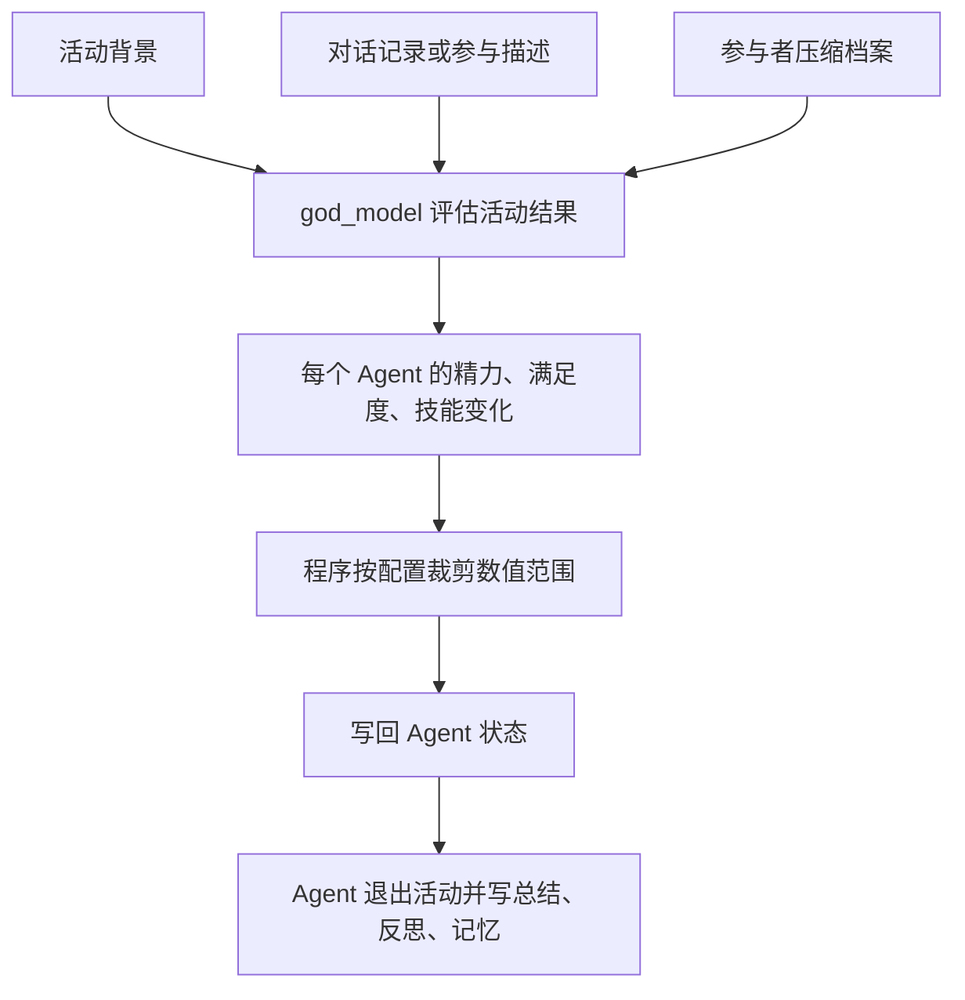
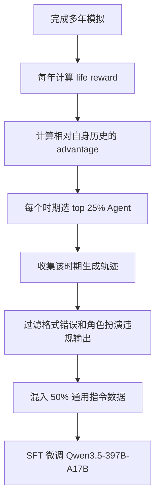

论文：[Agentopia: Long-Term Life Simulation and Learning in Agent Societies](https://arxiv.org/abs/2606.07513)，arXiv v1 提交于 2026-06-05。官方仓库是 [Neph0s/Agentopia](https://github.com/Neph0s/Agentopia)。这篇论文目前更适合当作一篇系统论文读，而不是当作“已经证明 LLM 学会社会智慧”的结果论文读。

Agentopia 做的事情可以概括成一句话：让 100 个 Agent 在一个模拟社会里生活 10 年，形成关系、职业、财富、状态和记忆，再用这些长期生活轨迹筛选训练数据，微调底层 LLM。

它的价值不在于最后指标有多强，而在于把一个很难的问题具体化了：如果 Agent 要长期生活在一个社会里，系统需要怎么组织时间、记忆、活动、环境反馈和奖励？这些模拟经验又能不能成为训练信号？

## 系统到底怎么跑

Agentopia 的基本时间结构是：

```text
year -> week -> day
```

论文实验配置里，每个模拟年有 10 周，每周有 5 个活动日和 5 轮联系阶段。每周流程不是“安排一个活动、马上执行一个活动”，而是先完成本周计划和排期，再按 5 个活动日执行。



Plan 阶段会让 Agent 给每天的空闲活动槽写下一个具体意图；Contact 阶段才正式约共同活动。联系结束后，系统统一处理取消、重复回复、时间冲突和活动创建条件。然后 Activity 阶段逐日执行，每天每个 Agent 最多一个活动槽。

活动分四类：

| 类型 | 来源 | 执行方式 |
| --- | --- | --- |
| 共同活动 | Contact 阶段约出来 | 多人多轮对话，环境模型选择下一位说话者并判断何时结束 |
| 个人活动 | 没有其他安排时默认生成 | Agent 描述意图，环境模型评估结果 |
| 偶遇活动 | 环境模型给空闲 Agent 安排 | 类似共同活动，但不是预先排期 |
| 公开活动 | 环境模型生成，Agent 报名 | 参与者各自执行，结束后获得活动摘要 |

这里最值得展开的是“环境交互”到底怎么落地。Agentopia 的环境不是一个连续运行的物理世界，而是一组由程序调度的活动容器；每个活动容器内部，再调用 `god_model` 生成环境反馈或活动结果。

以共同活动和偶遇活动为例，一轮交互大致是：



也就是说，`god_model` 在这里像一个叙事式环境引擎：它不控制参与者说什么，但会描述上一轮动作带来的环境反馈，并决定下一个谁更该行动。程序则负责回合数、参与者名单、动作解析和状态写入。送礼就是一个典型例子：如果某个 Agent 输出 `gift(to="...", item="...")`，`god_model` 不直接改背包；程序会检查发送者是否真的有这个物品，成功后才转移物品，并给双方发送系统通知。退出活动也是程序硬规则：某人退出后，会从后续发言候选里移除。

活动结束后还有一次单独的结果结算：



个人活动的流程更短：Agent 先用自然语言描述自己做了什么，`god_model` 判断这件事是否成立、产生什么结果、是否是消费事件；如果是消费事件，程序会进入购买选项、余额检查和物品变更的分支。公开活动也不是所有人坐在一个大群聊里，而是每个参与者独立生成一段参与描述，然后由 `god_model` 一次性评估所有参与者的结果；大型公开活动还会按组限制可见参与者。

用一个简单例子看会更直观。假设 Alice 和 Bob 在咖啡馆共同活动：

1. 程序创建活动，记录地点、参与者和活动背景。
2. `god_model` 先描述咖啡馆环境，例如“店里有轻微噪声，服务员端来菜单”，并选择 Alice 先说话。
3. Alice 生成自己的发言，比如邀请 Bob 聊最近的学习压力。
4. 程序把 Alice 的发言加入对话历史，再让 `god_model` 生成新的环境反馈，并选择 Bob 或结束活动。
5. 如果 Bob 输出送礼动作，程序检查 Bob 是否真的拥有该物品；如果没有，动作失败并反馈错误。
6. 活动结束后，`god_model` 根据活动背景、对话记录和两人的压缩档案，给出两人的状态变化，例如社交满足度上升、精力下降。
7. 程序裁剪数值范围，写入状态；然后每个 Agent 生成自己的活动总结和反思，必要时更新记忆文件。

所以这里说“世界由 LLM 驱动”大体成立，但要补一句限制：`god_model` 不是全知数据库。共同活动结果评估时，它拿到的是活动背景、对话记录、每个参与者的压缩档案；公开活动评估时，它拿到的是活动描述、参与者压缩档案和各自参与描述；偶遇生成时，它拿到的是空闲 Agent、关系名单、简短角色简介和可用地点。它不会自动读取每个相关 Agent 的完整记忆文件。角色 Agent 自己的 prompt 会包含近期记忆摘要和当前互动对象摘要，必要时可以调用 `read_scratchpad` 读完整记忆；但这和 `god_model` 的评估上下文不是一回事。

所以 Agentopia 不是游戏引擎式世界。它没有连续移动、寻路、碰撞、对象状态机，也不会像 Unity / Unreal 那样靠写死的脚本事件推进世界。它更像“程序骨架 + LLM 生成式环境引擎”：程序固定时间结构、动作格式、地点约束、排期规则和数值范围；环境模型负责生成活动反馈、公开活动、偶遇、职位评估、角色档案更新和输出过滤。

这也解释了它的动作空间。Contact 阶段只有四种结构化动作：

```text
contact
propose_joint_activity
respond_invitation
cancel_joint_activity
```

活动内容本身则更自由，Agent 可以用自然语言描述想做什么，环境模型判断是否可行以及产生什么结果。因此它不是完全无限制的自由文本世界，而是“结构化社交动作 + 自由形式活动意图”的混合系统。

## 记忆文件不是简单 memory stream

Agentopia 的长期记忆不是单一事件流，而是文件系统式记忆。论文称为 memory files，官方代码里对 Agent 暴露的名字是 `scratchpad`。

每个 Agent 维护三类文件：

```text
general.jsonl：个人计划、通用笔记、长期目标。
characters/<某人>.jsonl：关于某个具体人物的记忆、关系和印象。
others/<主题>.jsonl：其他主题记忆。
```

论文里的关键机制是 read-before-write：Agent 要更新已有文件，必须先在同一次调用中读过这个文件。代码里 `RoleAgent` 用 `_opened_scratchpads` 跟踪本轮读过哪些文件；没读过就调用 `update_scratchpad` 会返回错误。

代码实现还有一个细节：`update_scratchpad` 要求 Agent 提供“合并后的完整新内容”，底层再把这一版作为 JSONL 新行追加；`read_scratchpad` 读取当前时间之前的最新一版。也就是说，对 Agent 来说像是在覆盖一个文件；对系统来说，旧版本不会被删除，而是形成 append-only 版本日志。

上下文不是把所有文件都塞进 prompt。角色扮演 prompt 会放入最近访问的记忆摘要；当 Agent 认识超过 50 个角色时，只展示最近访问的 50 个角色记忆摘要，当前互动对象会被强制包含。代码里还可以看到 `other_limit=10`，也就是其他主题文件默认最多展示 10 个。

论文明确承认，记忆增长会推高输入 token 和运行时间，是长期模拟的主要计算瓶颈之一。论文和当前代码都说明了 prompt 侧的摘要和限流，但没有看到对单个 JSONL 记忆文件本体设置硬上限、自动截断或自动压缩的机制。

## Life reward 到底是什么

生活奖励（life reward）是这篇论文最重要、也最需要谨慎理解的部分。它不是人的真实幸福，也不是一个 LLM 直接输出的“幸福分”。论文明确说，三类奖励由外部环境决定或估计，而不是 Agent 自我报告。

生活奖励由三部分组成：

```text
total reward = 社会奖励 + 主观奖励 + 经济奖励
```

实际计算时，三类奖励先分别做 z-score 标准化，再按默认权重合成：

```text
社会奖励 0.4，主观奖励 0.4，经济奖励 0.2
```

**社会奖励**来自别人如何看你。更准确地说，代码里不是让被评 Agent 自己给自己打分，而是让 `god_model` 读取某个 Agent 的角色档案、记忆文件和近期关系记录，然后生成“这个 Agent 对熟人的喜爱分和尊重分”。这些分数构成有向图，再用加权 PageRank 聚合。

PageRank 原本是网页排序算法，直觉是：重要节点给你的认可，比边缘节点给你的认可更有分量。放到 Agentopia 里，就是被一个社会网络中重要的人喜欢或尊重，比被一个几乎没人认识的人喜欢或尊重更能提高社会奖励。论文还加入互相喜爱加成，被自己也重视的人重视，会被放大。

**主观奖励**也不是 Agent 自评。系统维护四个满足度维度：情绪、物质、社交、尊重。每次活动结束后，环境模型根据活动内容和参与情况给出状态变化，例如情绪 +3、社交 +2、精力 -1；程序把这些变化写入状态历史。年末计算主观奖励时，程序读取这一年的满足度历史，并对低满足度和低精力做惩罚。

**经济奖励**最直接，核心是年末存款减去年初存款。收入、生活标准、额外工作和消费都会影响它。

所以 life reward 更准确的理解是：

```text
模型生成中间信号 + 程序化奖励公式
```

它不是纯 LLM Judge，也不是硬指标。社会评分和活动状态变化依赖模型生成，最终聚合依赖程序公式。这也是它的风险所在：reward 看起来很完整，但里面有大量价值假设。

## 训练不是边跑边训

Agentopia 不是每年结束就在线训练一次。论文和代码都显示，训练是离线做的：先跑模拟，计算年度 life reward，再从模拟轨迹中选择高优势样本做监督微调。

官方仓库里的对应脚本是 `scripts/build_rft_data.py`。README 也明确说，它从一个已经完成的 simulation 中选择高优势轨迹并打包训练数据。

流程大致是：



这里的 advantage 不是直接和其他 Agent 比，而是看一个 Agent 相对自己过去是否变好。这个设计能减少初始设定带来的偏差：一个天生富有、受欢迎的角色不应天然贡献更多训练数据。

但这个训练设计有一个很粗的归因问题。奖励按 Agent 年度计算；选中某个 Agent 某一年后，该时期大量生成都会进训练集。系统没有进一步判断到底是哪句话、哪次邀请、哪次活动选择导致了奖励提升。论文限制部分也承认，没有探索更细粒度的 credit assignment。

## 实验结果需要保守看

论文构造了三个世界：

- The Apartment：纽约合住公寓。
- Arcane Academy：魔法学院。
- The Campus：中国高中，模拟用中文。

每个世界 100 个 Agent，模拟 10 年。主要模型是 Qwen3.5-397B-A17B；论文还说，当模型无法产生合法输出时，会用 Gemini 3 Flash 做备用重生成，让模拟继续跑下去。

训练部分使用前三个世界前四年的模拟数据，对 Qwen3.5-397B-A17B 做 1 epoch SFT，规模是 30 个节点、每个节点 8 张 H100 80GB。训练后模型叫 Qwen3.5-397B-Agentopia。

论文报告，训练后的模型在 The Campus 和 The Apartment 的 4 年模拟中有这些变化：

- 经济奖励平均提升 2.5%。
- 主观奖励平均提升 1.8%。
- 被尊重人数提升 24.2%。
- 被喜欢人数提升 15.9%。
- 社交满足度提升 9.7%。
- 尊重满足度提升 4.8%。
- 物质满足度下降 14.8%。
- 个人活动下降 19.8%。
- 技能提升次数下降 29.6%。

这不是一个“全面变好”的结果。更准确地说，训练后的模型更容易获得社会认可和部分满足度提升，但也可能减少个人活动、技能成长和物质满足。reward 会塑造行为偏好：有奖励或间接有利于奖励的行为被强化，reward 没覆盖好的行为可能被牺牲。

论文还用 CoSER Test 评估角色扮演能力。CoSER 是独立工作 *CoSER: Coordinating LLM-Based Persona Simulation of Established Roles*，arXiv 2502.09082，ICML 2025。它的数据来自 Goodreads Best Books Ever 前 1000 本中实际获取到的 771 本书，覆盖 17,966 个角色和 29,798 段真实书本文本中的多角色对话。Agentopia 使用 200 个 CoSER 测试样本，并用 Qwen3-235B-A22B 做评判模型。

论文报告 Qwen3.5-397B-Agentopia 在 CoSER 上平均分从 42.51 提升到 49.16，整体提升 15.6%。这个结果有价值，但也要注意：它仍然是 LLM 评判，不是人类评审。

## 成本和复现门槛

这不是轻量实验。每个世界 100 个 Agent 跑 10 年，论文给出的平均消耗是：

| 世界 | token | 调用次数 | 墙钟时间 |
| --- | --- | --- | --- |
| The Campus | 19.466B | 544K | 201.3h |
| Arcane Academy | 11.617B | 572K | 174.2h |
| The Apartment | 10.016B | 584K | 183.2h |
| 平均 | 13.700B | 567K | 186.2h |

输入 token 是主要成本。论文说平均每周约 133M 输入 token、3.5M 输出 token，并且随着记忆增长，输入 token 和运行时间会继续上升。这解释了为什么 Agentopia 要抽象掉低层物理操作：如果还要连续感知、移动、拿物品、检查对象状态，成本会更难控制。

## 这篇论文的问题

这篇论文的贡献不是证明“Agentopia 里的 Agent 已经学会人类社会智慧”，而是把长期 Agent 社会模拟做成了一个可运行、可计分、可抽取训练数据的系统。这个工程量其实很大：它要同时处理长期记忆、每周调度、多人通信、活动执行、环境反馈、状态更新、奖励计算、训练数据抽取和成本控制。评价这篇论文时，最好把“工程系统搭起来了”和“训练结论是否足够强”分开看。

比较有价值的地方有三个。

第一，它把时间尺度拉长到年。短期小镇模拟看不到的关系漂移、职业转向、财富积累、社交疲惫、长期满足度变化，在这里变成可观察对象。

第二，它把长期记忆从单一 memory stream 推到文件系统式外部工作区。Agent 可以读、写、创建记忆文件，虽然这种自主仍然受工具规则和 prompt 限制。

第三，它把社会模拟和模型训练接了起来。life reward 选择高优势轨迹，轨迹再变成 SFT 数据。这条链路很有启发性。

但它的训练结论需要保守看。

第一，life reward 的价值假设很强。社会、主观、经济三个维度可操作，但不等于人的真实福祉。论文自己的 Jun 案例就说明，减少社交广度、转向少数深度关系后，角色的情绪和精力上升，但社会奖励连续下降。

第二，环境模型承担太多。它是事件生成器、活动裁判、状态更新器、职位评估器、输出过滤器。很多“社会规律”实际上来自环境模型的判断，而不是来自一个独立的真实环境。

第三，训练信号来自模型社会内部。代码把 `role_model` 和 `god_model` 分开，社会评分也明确用 `god_model`；因此不能简单攻击成“微调后模型自己给自己打高分”。更准确的问题是：即使评价器固定，reward 提升到底来自更好的社会行为，还是来自模型更会生成让固定评价器认可的轨迹？论文没有给出足够的隔离实验来区分这两者。

第四，credit assignment 很粗。年度 reward 选中的是一整段 Agent 轨迹，而不是具体响应或具体决策。

第五，动作空间虽然自由，但缺少底层世界约束。它适合社会生活模拟，不适合证明 Agent 能在真实复杂环境中可靠行动。

因此这篇论文的读法应该是：把它当成长期社会模拟 Agent 的工程框架和问题提出，而不是把训练结果当成强结论。它真正留下的问题是：当行为、环境反馈和社会评分都高度依赖模型生成的中间信号时，我们如何判断 Agent 学到的是社会能力，还是学到了模拟器和奖励函数的偏好？
