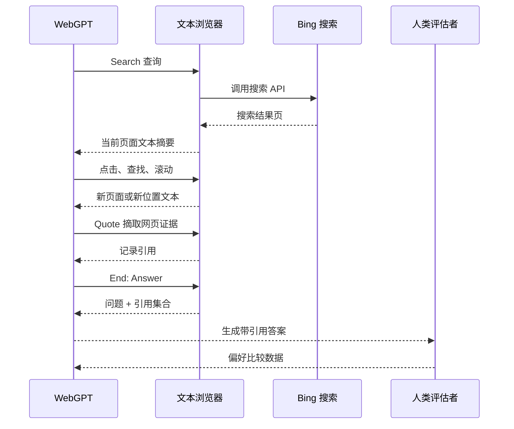
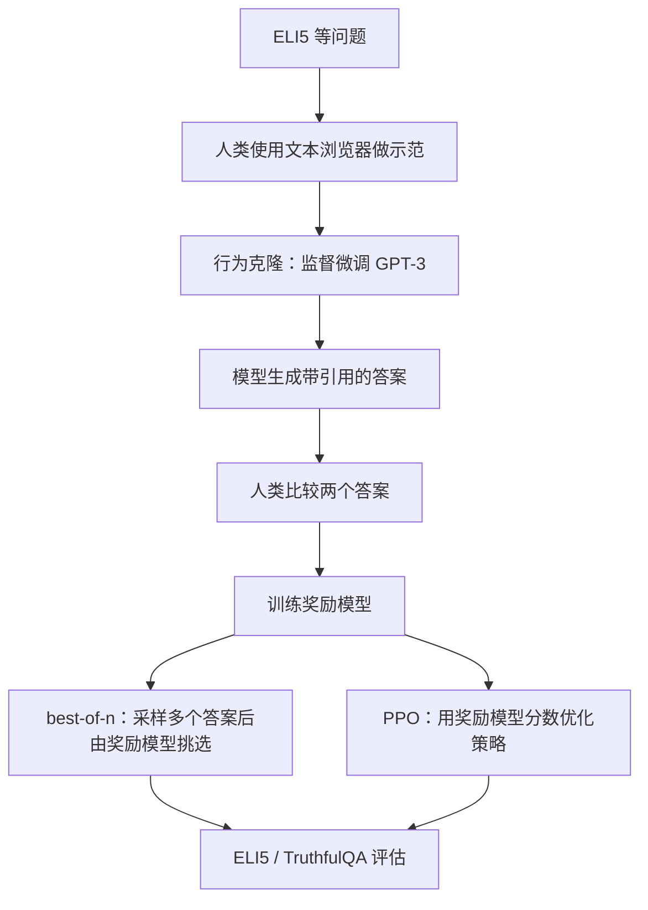

论文：[WebGPT: Browser-assisted question-answering with human feedback](https://arxiv.org/abs/2112.09332)，OpenAI，arXiv v1 提交于 2021-12-17，v3 修订于 2022-06-01。OpenAI 在 2021-12-16 发布过一篇对应介绍：[WebGPT: Improving the factual accuracy of language models through web browsing](https://openai.com/index/webgpt/)。

这篇论文做了一件很具体的事：把 GPT-3 放进一个受限的文本浏览器，让模型为了回答长问答问题去搜索网页、打开结果、页内查找、摘取引用，最后基于引用生成答案。它研究的不是“模型记住了多少知识”，而是“模型能不能像人一样先查资料，再组织答案”。

为了训练这个能力，WebGPT 收集人类浏览示范，让模型先学会使用浏览器；再收集人类偏好比较，训练奖励模型去判断哪个带引用答案更好。最后效果最强的方案不是单纯强化学习，而是让模型生成多个候选答案，再用奖励模型做 best-of-n 筛选。

这篇没有看到正式发表于会议或期刊的信息，更准确的引用方式是 arXiv / OpenAI research publication。

WebGPT 的核心贡献不是“GPT-3 会搜索”，而是把开放世界问答改造成了一个可以示范、比较、训练和审计的受限浏览器环境：

```text
文本浏览器环境 + 带引用的答案 + 人类偏好训练
```

这三个部分绑在一起，回答的是一个很早但现在仍然重要的问题：模型能不能先查资料，再组织答案，并让人类更容易检查它到底有没有依据？

它还不是完整的通用 Agent，但已经是一个前史节点：LLM 开始进入外部信息环境，并通过受限 action space 和人类反馈学习如何使用这个环境。

## 为什么不是普通 RAG

长问答（long-form question answering）不是一句事实查询。[ELI5](https://arxiv.org/abs/1907.09190) 是 Explain Like I'm Five 的缩写，原本来自 Reddit 的 [r/explainlikeimfive](https://www.reddit.com/r/explainlikeimfive/) 社区，问题通常要求把一个复杂现象解释给非专业读者听。WebGPT 使用的主要就是这类开放式长问答：它们往往需要解释背景、比较说法、综合多个来源，再组织成一段可读答案。

普通检索增强生成（RAG, Retrieval-Augmented Generation；可以参考早期 [RAG 论文](https://arxiv.org/abs/2005.11401)）更像：

```text
问题 -> 一次性检索相关文档 -> 把文档塞给模型 -> 生成答案
```

WebGPT 更像人类上网查资料：

```text
问题 -> 搜索网页 -> 打开结果 -> 页内查找 -> 摘取引用 -> 继续搜索 -> 写答案
```

这里的区别不只是“有没有搜索”。普通 RAG 常常把检索当成生成之前的前处理；WebGPT 把检索和浏览变成模型的动作序列。模型每一步都要根据当前网页状态决定下一步是搜索、点开链接、查找关键词、引用文本，还是结束浏览。

## 文本浏览器里的 action space

WebGPT 的浏览器不是日常使用的图形浏览器，而是一个文本化环境。模型每一步看到的是当前状态摘要，包括问题、当前页面文本片段、搜索结果、已收集引用、过去动作和剩余动作数。

模型必须输出固定命令。动作空间（action space）就是“模型被允许输出哪些动作”的集合。论文中的动作空间包括：

```text
Search <query>
Clicked on link <link ID>
Find in page: <text>
Quote: <text>
Scrolled down <1, 2, 3>
Scrolled up <1, 2, 3>
Top
Back
End: Answer
End: <Nonsense, Controversial>
```

`Search <query>` 会调用 Bing Web Search API；`Clicked on link <link ID>` 只能点击当前页面里已经出现的链接编号，不能随便生成 URL；`Find in page: <text>` 相当于页内搜索；`Quote: <text>` 只有在文本确实出现在当前页面里时，才会被记录为引用；`End: Answer` 结束浏览，进入最终回答阶段。

这组动作很窄，但窄本身就是设计的一部分：人类容易示范，模型输出是否合法容易判定，环境风险也被压低。代价是它只能做只读式浏览和引用，不是开放网页操作 Agent。

一次简化的 WebGPT 浏览过程大致是：



论文 Figure 1 里的例子是“如何训练附近的乌鸦给我带礼物”。浏览器会展示搜索结果、页面标题、链接摘要、已经引用的文本和过去动作，模型在这些文本状态上继续选择动作。

一个更抽象的过程可以这样理解：

```text
问题：为什么某些词会被认为是不适合在社交场合使用的“坏词”？

Search why are some words considered bad words
Clicked on link 0
Find in page: taboo
Quote: 某段解释 taboo / swearing / social norm 的网页文字
Back
Search origin of swear words social norms
Quote: 另一段解释情绪、宗教、身体、身份攻击相关的文字
End: Answer
```

这里模型不是一次性拿到几篇文档再回答，而是在浏览过程中不断决定“下一步查什么、点哪里、引用哪段”。用 Agent 术语说，它已经有了 observation（环境返回的当前状态）、action（模型选择的动作）、tool use（调用搜索和浏览器工具）和 trajectory（多步动作与观察组成的轨迹）。

## 训练：示范、偏好和奖励模型

WebGPT 收集了两类人工数据。

第一类是 demonstrations，也就是人类示范如何用文本浏览器回答问题。模型用这些轨迹做行为克隆（behavior cloning）：不先让模型自己探索，而是先监督微调它去模仿人类浏览轨迹，学会浏览器命令格式和基本搜索策略。

第二类是 comparisons，也就是人类比较两个带引用答案哪个更好。论文总共收集约 6,000 条示范和约 21,500 条比较，附录表格里的总数是 6,209 demonstrations 和 21,548 comparisons，其中绝大多数来自 ELI5。

训练流程可以概括成：



论文尝试了四种训练或推理策略：

| 方法 | 作用 |
|---|---|
| Behavior Cloning | 用人类浏览示范监督微调，让模型学会如何使用浏览器 |
| Reward Modeling | 奖励建模，用人类偏好比较训练奖励模型，预测哪个答案更受偏好 |
| Reinforcement Learning | 用 [PPO](https://arxiv.org/abs/1707.06347) 根据奖励模型优化策略，并加入 KL 惩罚避免偏离过大 |
| Rejection Sampling / best-of-n | 拒绝采样 / 多候选筛选，生成多个候选答案，用奖励模型选分数最高的一个 |

最值得注意的是，论文的最好结果不是单纯靠 PPO 得到的，而是：

```text
behavior cloning + rejection sampling against reward model
```

也就是说，先让模型模仿人类会用浏览器，再让它生成多个候选答案，最后用奖励模型挑一个更好的。WebGPT 的能力不只是来自模型参数，也来自运行时组织：多条浏览轨迹、多个候选答案、奖励模型重排。后来的 best-of-n（生成多个候选再选一个）、reranking（对候选重新排序）、LLM-as-judge（让语言模型充当评判器）、verifier（验证器）和 Agent trajectory selection（从多条 Agent 执行轨迹里选更好的），都能在这里看到早期影子。

这里的 PPO 是一种强化学习算法，常用于在“优化奖励”和“不让模型偏离原始行为太远”之间折中。KL 惩罚里的 KL 指 KL 散度（Kullback-Leibler divergence），可以粗略理解成两个概率分布之间的差异；在这里，它用来惩罚策略相对行为克隆模型偏离过大。

不过奖励模型不是事实正确性的神谕。它学的是人类偏好：给定同一个问题的两个带引用答案，预测标注者更喜欢哪一个。论文把奖励解释成一种 [Elo 分数](https://en.wikipedia.org/wiki/Elo_rating_system)，也就是常见于棋类和竞技排名的相对评分方式；两个答案的分数差对应“人类更偏好其中一个”的概率。

这决定了 WebGPT 的优化目标不是形式化的“真实”，而是人类偏好下的答案质量。模型可能学到更好的查证和综合，也可能学到更像高质量解释、更像有可靠引用的表面特征。

## 评估和引用的边界

WebGPT 主要在 ELI5 和 [TruthfulQA](https://arxiv.org/abs/2109.07958) 上评估。TruthfulQA 是一个专门测试模型是否会复述常见错误观念的问答基准，比如迷信、误传、医学误解等问题。

ELI5 评估有两类比较：

```text
WebGPT vs. 人类示范者
WebGPT vs. Reddit 最高赞答案
```

论文报告，175B best-of-64 WebGPT 相对人类示范者有 56% 偏好率，相对 ELI5 Reddit 最高赞答案有 69% 偏好率。

这个结果不能理解成“WebGPT 全面超过人类”。它是在特定任务、特定评估协议下比较答案偏好。尤其是与人类示范者比较时，人类也使用同一个文本浏览器环境，双方的限制相近。

和 Reddit 最高赞答案比较时，论文为了公平会去掉 WebGPT 答案里的引用，因为 Reddit 答案通常没有引用。但这也带来一个问题：去掉引用后，评估者更难直接检查事实支持；而且 WebGPT 和 Reddit 答案的文风仍然不同，很难做到完全盲评。

论文报告 WebGPT 在 TruthfulQA 上相比 GPT-3 更真实、更有信息量，但仍落后于人类，并且会引用不可靠来源。这正好说明 WebGPT 的边界：浏览网页和引用能减少一部分幻觉，但不会自动解决真伪判断。

WebGPT 最容易被误读的一点，是把引用当成“事实正确”的保证。更准确地说，引用是一种审计接口：

```text
它解决的是：
模型不能完全无来源地编答案
人类评估者可以检查答案声称来自哪里
答案中的事实声明更容易被追溯

它没有解决的是：
网页来源本身可能错误
引用片段可能不能真正支持结论
模型可能误读来源
奖励模型可能偏好“看起来有依据”的答案
```

论文在讨论 truthful answer 时区分了两类错误。

第一类是 imitative falsehood，可以译成“模仿式错误”：模型因为训练目标复述常见错误观念。WebGPT 对这类错误有帮助，因为它会去查资料，并被鼓励使用可靠来源。

第二类是 non-imitative falsehood，可以译成“非模仿式错误”：模型本来想完成目标，但因为失败而生成看似合理的错误内容。WebGPT 仍然会犯这种错误，例如误读网页、错误综合信息、引用不可靠来源。

引用把问题从“模型凭空编”推进到“模型是否正确查、正确读、正确综合”。问题变得更容易检查，但没有消失。这也是今天 AI 搜索和研究型 Agent 仍然绕不开的问题：带引用的答案会显得更权威，但权威感不等于正确性。

## 和 RAG、ReAct 的关系

WebGPT、普通 RAG 和 ReAct 可以放在一起看，但不能混成一件事。

| 维度 | WebGPT | 普通 RAG | ReAct |
|---|---|---|---|
| 核心任务 | 长问答 | 知识增强生成 | 通用推理 + 行动 |
| 环境 | 文本浏览器 | 检索器 / 文档库 | 可替换的外部环境 |
| 动作空间 | 搜索、点击、查找、引用、滚动、结束 | 通常没有显式多步动作 | Thought / Action / Observation |
| 训练方式 | 人类示范 + 偏好比较 + 奖励模型 | 常见是检索器和生成器训练或工程组合 | 论文主要是提示词（prompting）/ 少样本（few-shot）轨迹 |
| 记忆 | 当前摘要、过去动作、引用 | 检索上下文 | 轨迹上下文 |
| 主要风险 | 引用不保证真实，偏好优化可能偏向“看起来可信” | 检索噪声、文档污染、生成幻觉 | 工具错误、轨迹失控、检索失败 |

WebGPT 比 [ReAct](/posts/react-paper-reading/) 更早，但更窄。它没有给出通用 thought/action/observation 范式，而是围绕文本浏览器辅助长问答设计了一个可训练环境。

ReAct 的意义是把 reasoning 和 acting 变成更通用的交错闭环；WebGPT 的意义则是更早地展示了另一件事：LLM 可以在一个受限外部环境里行动，行动轨迹可以被人类示范和偏好数据训练。

这也是它适合放在 Agent 时间线前史位置的原因：它比 ReAct 窄，但更早展示了“LLM + 外部信息环境 + 人类反馈”的组合。

## 后续工作：搜索型 Agent 和浏览器 Agent

WebGPT 的后续影响不是一条很干净的“WebGPT -> 某篇论文 -> 某个系统”单线谱系。更准确地说，它把问题拆开以后，后面至少长出了两条线。

第一条是 **搜索型 Agent**：核心动作是查资料、分解问题、检索、阅读、引用、综合。它改变的是模型的信息状态，不一定改变外部网页状态。

第二条是 **浏览器 / 网页操作 Agent**：核心动作不只是读网页，还包括点击按钮、填写表单、提交任务、在真实网页环境中完成操作。它开始改变外部环境状态，风险和评测难度都更高。

如果沿着 WebGPT 往后读，可以按下面的优先级来。

| 后续工作 | 和 WebGPT 的关系 | 是否值得读 |
|---|---|---|
| [Self-Ask with Search](https://arxiv.org/abs/2210.03350) | 把复杂问题拆成 follow-up questions，再接搜索引擎回答子问题。它没有 WebGPT 的浏览器环境和引用训练，但很适合理解“搜索前先分解问题”这条线。 | 值得读，尤其适合补“搜索型 Agent 如何规划查询”。 |
| [ReAct](https://arxiv.org/abs/2210.03629) | 把 reasoning 和 action / observation 做成更通用的交错轨迹。WebGPT 是受限浏览器问答，ReAct 是更通用的行动闭环。 | 必读；这篇已经是 Agent 主线基础节点。 |
| [Toolformer](https://arxiv.org/abs/2302.04761) | 不强调多步浏览，而是让工具调用进入训练数据。它和 WebGPT 都关心“模型如何学会用外部工具”，但一个偏浏览环境，一个偏训练时工具调用能力。 | 值得读；适合和 WebGPT 一起理解 tool use 的两种路径。 |
| [GAIA](https://arxiv.org/abs/2311.12983) | 不是 WebGPT 的直接后续系统，而是把网页检索、推理、多模态和工具使用做成通用助手评测。 | 值得读；如果关心“搜索型 Agent 怎么评测”，它比单纯 QA benchmark 更接近现实。 |
| [BrowseComp](https://arxiv.org/abs/2504.12516) | 专门评测浏览 Agent 找到难以检索、需要持续搜索的短答案。它不像 WebGPT 那样写长答案，但更集中考察“会不会真的搜到”。 | 非常值得读；这是 WebGPT 之后“搜索 / 浏览能力评测”很直接的一条线。 |
| [BrowseComp-ZH](https://arxiv.org/abs/2504.19314) / [MM-BrowseComp](https://arxiv.org/abs/2508.13186) | BrowseComp 的中文网页和多模态扩展，分别强调中文信息生态和图像/视频中的信息。 | 选读；如果后面要写中文 Web Agent 或多模态浏览 Agent，就值得单独展开。 |
| [Mind2Web](https://arxiv.org/abs/2306.06070) / [WebArena](https://arxiv.org/abs/2307.13854) | 从“网页搜索问答”转向“真实网页操作”。Agent 要在网页上完成任务，而不只是读网页和引用。 | 值得读，但它们已经是网页操作 Agent 线，不是纯搜索线。 |
| [Deep Research](https://openai.com/index/introducing-deep-research/) / [Operator](https://openai.com/index/introducing-operator/) | 产品化分叉：Deep Research 更接近搜索型研究 Agent，Operator 更接近网页操作 Agent。 | 适合作为工程和产品后续，不适合当作论文主线的第一批精读对象。 |

所以可以说，WebGPT 确实更偏 **Agent 的搜索 / 研究方向**。它关心的是：模型如何在外部信息环境中持续查找证据、筛选来源、生成带引用答案，并通过人类反馈优化这个过程。它也预示了浏览器 Agent 的另一半问题：一旦动作从“搜索和引用”扩展到“点击、提交、购买、修改”，系统就不只是信息检索了，而变成带权限、状态改变和安全风险的真实网页操作。

## 小结

WebGPT 的重要性在于打开了方向，不在于已经解决开放网页 Agent。它很早地把 LLM、外部信息环境、引用和人类反馈连成了一个可训练系统；同时，它仍然只是一个窄任务、窄动作、窄权限的问答 Agent 原型。

这篇最值得带走的判断是：引用和人类偏好能降低幻觉成本，但不能直接等价于事实正确性。这个问题后来在 AI 搜索、研究型 Agent 和浏览器 Agent 里一直没有消失。
