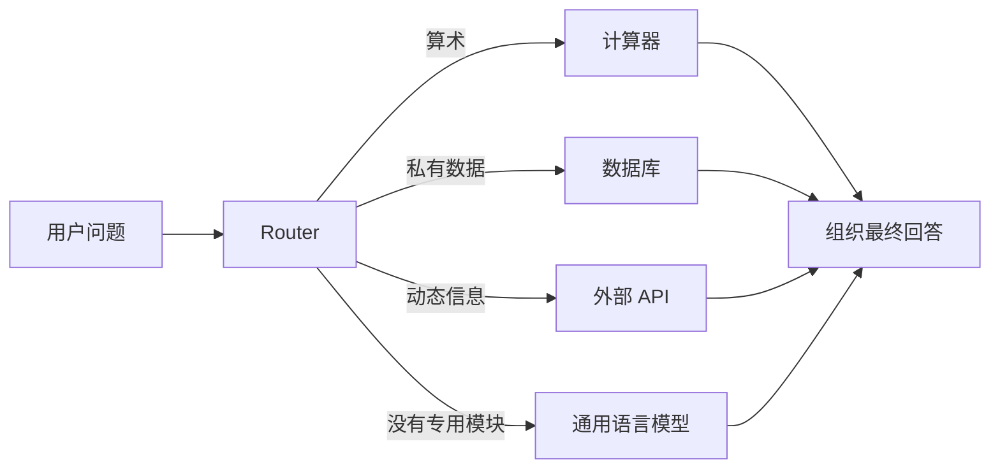

大语言模型擅长理解自然语言，却不适合把所有知识和计算都塞进参数里。汇率会变，公司数据库不公开，四位数乘法也没有必要让模型靠 token 概率“猜”。MRKL Systems 在 2022 年提出的核心判断是：语言模型可以留在系统中心，但它不必亲自完成每一种任务。

这篇工作的价值不只是提前画出了“LLM + tools”的框图。它进一步追问了一个今天仍然存在的工程问题：

> 当语言模型决定调用一个确定性模块时，怎样把自然语言可靠地转换成模块真正能执行的参数？

论文用计算器做实验，结果恰好说明：把计算交给工具以后，系统并不会自动可靠。错误只是从“模型算错了”转移到了“模型选错工具、抽错参数、拼错表达式”。

## 原文信息

- 论文：[MRKL Systems: A modular, neuro-symbolic architecture that combines large language models, external knowledge sources and discrete reasoning](https://arxiv.org/abs/2205.00445)
- 作者：Ehud Karpas 等，AI21 Labs
- 时间：2022 年 5 月
- 公开材料：[AI21Labs/MRKL_synthetic_data](https://github.com/AI21Labs/MRKL_synthetic_data)

MRKL 是 **Modular Reasoning, Knowledge and Language** 的缩写，读作 miracle。论文既是一篇架构提案，也是 AI21 Labs 当时的 Jurassic-X 系统说明；公开实验则集中在“自然语言算术题如何转成可执行表达式”。因此，阅读时需要把两层证据分开：论文提出了一个广泛的模块化系统愿景，但实际量化验证的是其中一个很窄、也很关键的接口问题。

## 为什么不让一个大模型包办所有任务

论文列出了四类限制。

第一类是**动态信息**。天气、汇率、股票价格和当前日期不断变化，预训练参数不可能实时同步。

第二类是**私有信息**。企业客户名单、内部库存、游戏状态等数据不在公开训练语料里，也不应该靠重新训练模型来接入。

第三类是**确定性推理**。计算器、数据库查询和规则引擎已经能稳定完成一些任务，让语言模型近似模拟这些能力，通常更贵也更不可靠。

第四类是论文所说的 **model explosion**：如果每增加一个任务都微调并部署一个大模型，模型数量和训练成本会持续膨胀；如果把所有任务一起做多任务训练，新增任务又可能要求重新训练，并带来灾难性遗忘。

MRKL 的回答不是抛弃语言模型，而是调整它在系统里的职责：

```text
语言模型负责理解开放的自然语言
专用模块负责访问外部知识或执行确定性过程
路由器负责把两边接起来
```

这是一种神经符号系统。这里的“神经”主要指语言模型和路由模型，“符号”不是泛指老式 AI，而是指计算器、数据库、API、规则程序这类输入输出边界明确、可以实际执行的模块。

## MRKL 系统怎样运行

一个 MRKL 系统包含两类组件：一组可扩展的 expert，以及一个 router。

**Expert** 是能够处理某类输入的模块。它可以是通用大模型或更小的专用模型，也可以是计算器、货币转换器、数据库查询和外部 API。

**Router** 接收用户的自然语言输入，判断应该交给哪个 expert。模块的输出可以直接成为最终答案，也可以继续路由给另一个模块，从而形成组合调用。



论文认为这种结构有六个好处：没有匹配模块时可以回退到通用模型；增加 expert 时不必重训整个系统；模块选择能提供一定可解释性；外部 API 可以提供动态信息；数据库可以提供私有知识；多个模块还可以组合处理多跳问题。

这些主要是架构主张，不全是论文实验已经验证的结论。尤其是“安全回退”今天需要更谨慎地理解：把未知问题交回通用模型，只保证系统还能输出文本，不保证输出正确或安全。生产系统通常还需要拒答、人工接管、权限检查和置信度门槛。

## 真正困难的是神经与符号之间的接口

路由器决定调用计算器以后，计算器不能直接执行一段自然语言。它需要明确的操作数、运算符和括号结构。

以官方数据仓库给出的样本为例：

```json
{
  "prompt": "How much is 27395 plus 87971 plus 25658?",
  "execution": 141024.0,
  "completion": "X=(27395+87971+25658)"
}
```

这里至少存在三个不同对象：

1. 用户输入的自然语言问题；
2. 模型抽取出的形式化表达式 `X=(27395+87971+25658)`；
3. 计算器执行后得到的结果 `141024.0`。

模型不负责算出 `141024`。它负责识别三个操作数和两次加法，并生成计算器能够执行的表达式。只要表达式正确，数字从五位增加到九位并不会让计算器变笨；但如果模型把 `plus` 识别错、漏掉一个数或放错括号，计算器会非常可靠地执行一个错误表达式。

论文把这一步称为跨越 **neuro-symbolic chasm**，也就是跨越神经模型与符号模块之间的鸿沟。难点不是把两个方框画一条箭头，而是让箭头上的数据具有稳定、可验证的语义。

## Jurassic-X 如何训练参数抽取

论文使用 70 亿参数的 J1-large，并通过 10 个 prompt token 做 prompt tuning。这里的 prompt tuning 不是手写十个自然语言示例，而是训练一小组连续向量，让冻结的大模型适应“把自然语言算术题转换成表达式”的任务。

训练数据由模板合成，覆盖五个维度：

| 维度 | 变化 |
| --- | --- |
| 数字表示 | `48`，或 `forty eight` |
| 位数 | 1 到 9 位 |
| 运算类型 | 加、减、乘、除 |
| 运算数量 | 一步或两步 |
| 组合结构 | 不同括号和运算优先级 |

两步运算一共整理出 29 种能够自然表达的公式结构。训练集与测试集不仅避免文本重复，也避免同一个底层算式换一种说法后分别落入训练集和测试集。

这个设计的工程含义很直接：为工具生成训练和测试数据时，不能只随机替换数字。真正需要覆盖的是输入空间的结构维度，例如措辞、参数表示、嵌套层级、可选字段、运算组合和边界值。

## 实验到底证明了什么

### 位数扩展几乎不再是问题

模型只用一位数算式训练，然后测试一到九位数。加法在所有位数上都是 100% 准确；乘法除六位数为 98% 外，其余也是 100%。论文引用的 GPT-3 纯语言模型加法结果则从两位数的 100%，下降到三位数 80.4%、四位数 25.5%、五位数 9.3%。

这个对比支持的不是“Jurassic-X 更会算术”，而是另一件事：

> 一旦模型只负责抽取表达式，计算复杂度就由计算器承担，参数抽取不必随数字位数同步退化。

### 数字与英文数字词之间存在明显不对称

当训练和测试都使用阿拉伯数字时，准确率是 100%；都使用英文数字词时是 98.8%。用英文数字词训练后测试阿拉伯数字，仍有 98.7%；但只用阿拉伯数字训练，再测试英文数字词，准确率只有 15.6%。

这说明“数字 `58`”和“fifty eight”并不是模型自然等价的两种表面形式。训练数据覆盖了更复杂的语言形式，可能向简单形式泛化；反方向却不成立。工具参数评测不能因为 schema 相同，就假设不同自然语言表达会得到相同行为。

### 换一种句式，平均高分仍会掩盖薄弱点

模型只用一种问句格式训练，再测试五种表达格式。多数问句格式接近 100%，但唯一不是问句的格式明显更不稳定：减法平均 86.3%，除法平均 72.7%，而且不同运行之间方差很大。

因此，“模型能泛化到新措辞”只能在有限模板空间内成立。真实用户会使用省略、指代、错别字、单位混合和隐含条件，远比五个模板复杂。

### 跨运算泛化并不均匀

同一种运算训练和测试时，四类运算都超过 99%。但用一种运算训练后测试另一种，结果差异很大。用加法训练可以较好地泛化到减法和乘法，却只能在除法上达到 47.7%；用除法训练再测试乘法只有 23%。

这意味着参数抽取器并没有学到一个完全通用的“自然语言到算术语法”转换器。它仍然依赖训练时见过的操作类型和措辞分布。

### 组合结构是最值得看的失败

在两步运算的 29 种公式中，有 22 种超过 90%，但某些括号结构表现很差，例如 `((A+B)*C)` 平均只有 28.8%，`A+B*C` 只有 40.6%。

另一个实验只用单步问题训练，再测试 16 种两步组合。多数结构表现很好，但 `add-mul` 只有 1%，`sub-mul` 为 20.2%，`sub-div` 为 22.4%。论文把部分失败归因于嵌套的前缀式措辞，例如“2 与 4 和 8 的乘积之和”。

这组结果比接近 100% 的位数实验更有启发。参数数量变大并不一定困难，结构组合才容易暴露分布外失败。对今天的工具调用来说，类似风险会出现在嵌套 JSON、多工具依赖、条件字段和跨步骤引用中。

## 论文没有证明什么

MRKL 提出了通用语言模型、数据库、API 和符号模块协作的完整愿景，但公开量化实验只验证了算术表达式抽取。

论文没有给出以下问题的系统评测：

- 大量 expert 同时存在时，模块选择是否可靠；
- 模块描述相似时，router 会不会混淆；
- 多模块链式调用能否稳定完成真实任务；
- 外部 API 超时、报错或返回脏数据时怎样恢复；
- 权限、审计和副作用怎样管理；
- 回退到通用模型后，错误是否反而更难发现。

Jurassic-X 的完整 runtime 也没有公开。官方仓库公开的是论文算术实验使用的 JSONL 合成数据，而不是 router、模块注册、执行器和生产服务代码。因此，这篇论文最扎实的证据是“符号接口需要专门训练和评测”，而不是“一个通用 MRKL Agent 已经被完整验证”。

## 与 ReAct、Toolformer 和 Function Calling 的区别

| 工作 | 核心问题 | 工具调用从哪里来 | 是否强调多步环境反馈 |
| --- | --- | --- | --- |
| MRKL | 如何把 LLM 接到可扩展模块系统 | 专门 router 选择模块并抽取参数 | 不是论文重点 |
| ReAct | 如何在推理与行动之间形成闭环 | 模型在轨迹中生成 Action | 是，依赖 Observation |
| Toolformer | 如何让模型自己学会何时插入 API call | 从候选调用中筛选训练样本 | 否，重点在训练数据构造 |
| [Function Calling](https://developers.openai.com/api/docs/guides/function-calling/) | 如何用统一 schema 让模型请求宿主程序调用工具 | 模型输出工具名和结构化参数 | 由上层 Agent runtime 决定 |

MRKL 更像系统架构的前身。ReAct 关心的是运行时轨迹，Toolformer 关心的是模型怎样从数据中获得工具使用能力，而今天常见的 Function Calling 把模块名和参数 schema 直接放进模型接口。宿主程序读取工具调用请求、校验参数、执行函数，再把结果送回模型。

因此，MRKL 的 router 在现代系统里经常不再是一个单独训练的轻量模型，而被合并进支持工具调用的通用模型。但系统边界没有消失：工具仍由宿主执行，参数仍需验证，结果仍可能失败，权限和副作用仍由外部程序负责。

## 今天实现时应该保留什么

MRKL 最值得保留的不是名称，而是职责拆分。

```text
自然语言理解 != 参数已经合法
工具选择正确 != 工具执行成功
工具执行成功 != 用户目标已经完成
```

一个最小实现可以写成下面这样：

```python
experts = {
    "calculator": {
        "schema": CalculatorArgs,
        "handler": run_calculator,
        "permission": "read_only",
    },
    "customer_db": {
        "schema": CustomerQuery,
        "handler": query_customer_db,
        "permission": "private_data",
    },
}

decision = router(user_input, describe(experts))
expert = experts[decision.name]
args = expert["schema"].validate(decision.arguments)
authorize(user, expert["permission"], args)
result = expert["handler"](**args)
answer = render_answer(user_input, decision, result)
```

真正进入生产环境时，还需要补上几层：

1. **参数校验**：类型、范围、枚举、必填字段和跨字段约束不能只靠模型保证。
2. **权限与副作用**：读数据库、发邮件、付款和删除文件不能共享同一种确认策略。
3. **执行失败处理**：超时、限流、空结果和部分成功必须成为显式状态，而不是重新让模型猜。
4. **分层日志**：分别记录工具候选、选择结果、参数、执行返回和最终回答，才能定位错误发生在哪一层。
5. **分层评测**：工具选择准确率、参数准确率、执行成功率和端到端任务成功率要分开测。
6. **分布外测试**：除标准样本外，还要测试同义改写、含糊输入、嵌套结构、极端数值和恶意参数。

论文用模板合成数据训练接口的做法今天仍然有用，但不能只在同一批模板上切分训练集和测试集。更可靠的做法是保留由不同人编写的真实表达、单独设计结构分布外测试，并用实际执行结果而不是参数字符串相似度作为最终验证。

## MRKL 留下的思想

MRKL 没有给出今天 Agent runtime 的完整答案，却很早地抓住了一个不会随模型升级自动消失的问题：模型与工具之间需要一条明确、可训练、可验证的接口。

它的实验也提醒了一件容易被平均分掩盖的事。参数抽取器可以在九位数上达到 100%，却可能因为数字写成英文、句子不再是问句，或者两个运算换了一种嵌套方式而突然失效。工程可靠性不能只看模型“总体上会不会调用工具”，而要追踪它在每一种输入结构和执行边界上怎样失败。

从这点看，MRKL 的主要贡献不是发明了某个今天仍需照搬的框架，而是把 Agent 工程中的一个核心边界说清楚了：

> 让模型负责理解开放世界，让程序负责执行确定性动作，并对两者之间的交接单独训练、单独验证、单独观测。
